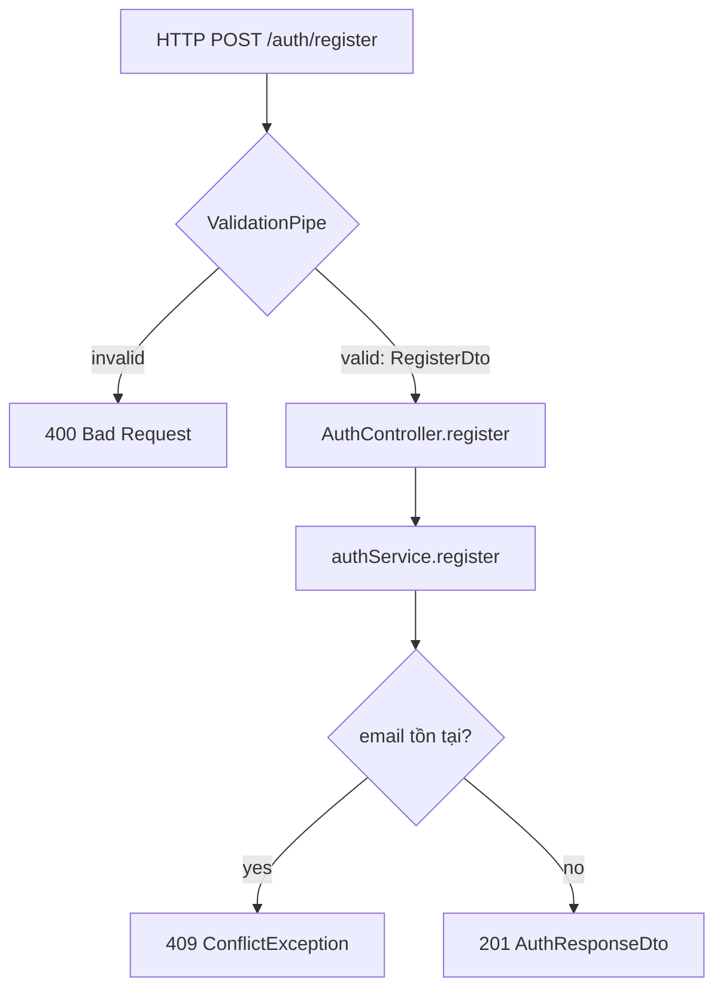

### Controller

BẮT BUỘC liệt kê và giải thích TẤT CẢ method trong controller (Public, Private, Protected).

**1. Decorator trên class**
- `@Controller('auth')` → tiền tố route, tại sao đặt ở đây không phải trong route method.
- `@UseGuards(...)` ở class level → áp dụng cho tất cả method, khi nào nên để ở class vs method.
- `@ApiTags(...)` hoặc `@UseInterceptors(...)` nếu có.

**2. Với TỪNG method (Entry Point Mapping):**
- **URL Đầy đủ**: Kết hợp path của `@Controller` và path của method (Ví dụ: `POST /auth/register`).
- HTTP decorator: `@Get`, `@Post`, `@Put`, `@Delete`, `@Patch` → Giải thích ý nghĩa của từng method này trong REST API.
- `@HttpCode(...)` nếu có → tại sao override status mặc định.
- Guard trên method: tại sao method này cần guard riêng, hoặc override guard của class.
- Param decorators từng cái:
  - `@Body()` → lấy từ đâu, validate qua DTO nào, nếu thiếu thì sao.
  - `@Param('id')` → lấy từ URL path, tại sao dùng UUID hay Number.
  - `@Query(...)` → query string, dùng cho filter/pagination.
  - `@CurrentUser()` → custom decorator, lấy dữ liệu từ đâu (Request user).
- Return value: trả về DTO nào, cấu trúc ra sao.
- Logic check: Tại sao controller KHÔNG có logic xử lý nghiệp vụ, nó chỉ điều hướng request.

**3. Private Helpers & Internal Logic (nếu có):**
- Giải thích các private method trong controller phục vụ cho việc format response hoặc tiền xử lý dữ liệu trước khi gọi service.

**4. Tại sao cần Controller tách riêng**
- Controller chỉ làm 2 việc: nhận request + gọi service.
- Không query DB, không hash password trực tiếp.

---
### End-to-End Request Flows (Section 7) [GHI VÀO FILE: -flows.md]

Bắt buộc viết đầy đủ flow cho TẤT CẢ endpoints, không chỉ 1. Dùng format numbered steps, mỗi step ghi rõ Layer nào đang chạy. 
Format chuẩn cho mỗi endpoint: `[Step N] [Layer]: [action] → [result]`
Layer có thể là: Network / Global Middleware / Global Pipe / Guard / Local Pipe / Controller / Service / Repository / Prisma / External API / Global Interceptor / Response

Với TỪNG endpoint phải cover đủ:

**Ví dụ POST /auth/register**
- Global Pipe validate RegisterDto trước khi vào controller
- Không có Guard
- Service check email tồn tại → hash password → create user → sign JWT
- Repository gọi findByEmail trước, nếu null thì gọi create
- Prisma thực thi SELECT rồi INSERT

**Ví dụ POST /auth/login**
- Global Pipe validate LoginDto
- Không có Guard
- Service: toLowerCase → findByEmail → check passwordHash tồn tại → bcrypt.compare → sign JWT
- Lưu ý: bcrypt.compare là async, mất ~250ms, phải await
- Prisma thực thi SELECT

**Ví dụ POST /auth/google**
- Global Pipe validate GoogleLoginDto (chỉ check idToken không rỗng)
- Không có Guard
- Service: verifyIdToken gọi External Google API → getPayload → findByGoogleId → nếu null thì findByEmail → nếu null thì create, nếu có thì update googleId
- Có thể có 2-3 Prisma queries trong 1 request

**Ví dụ GET /auth/me**
- Không có Body, không có Pipe validate
- Guard JwtAuthGuard chạy TRƯỚC controller: extract token → verifyAsync → attach request.user
- Controller dùng @CurrentUser() lấy từ request.user (không query DB lại)
- Service.me() query DB 1 lần nữa để lấy data fresh
- Giải thích tại sao query DB lần 2 thay vì dùng data từ JWT payload

Sau mỗi flow text, vẽ Mermaid diagram tương ứng.

---
### Controller diagram [GHI VÀO FILE: -flows.md]

Vẽ luồng request đi qua controller method:
- Bắt đầu từ HTTP Request
- Qua từng Guard (nếu có)
- Qua ValidationPipe + DTO
- Vào Controller method
- Gọi Service method nào
- Trả về response hoặc exception

Ví dụ format:
