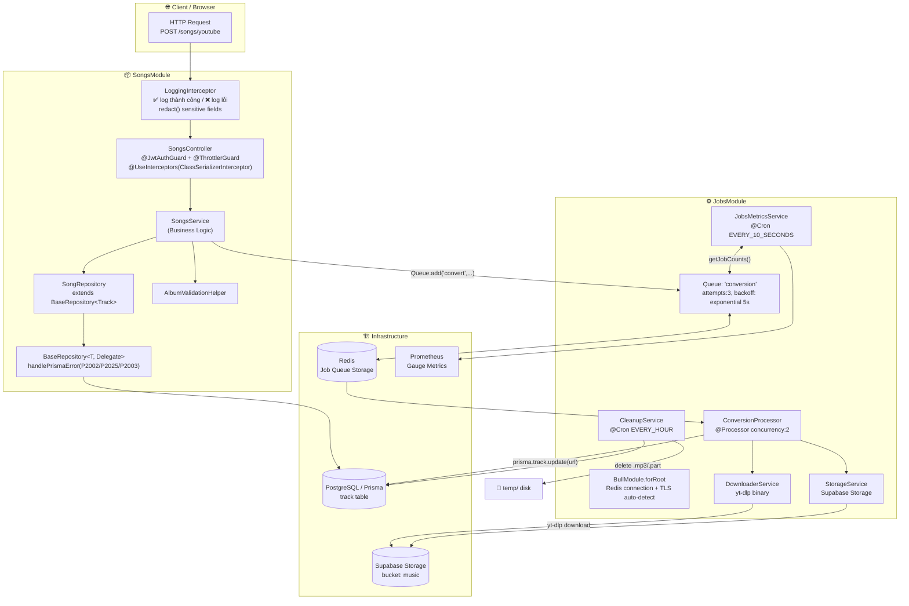
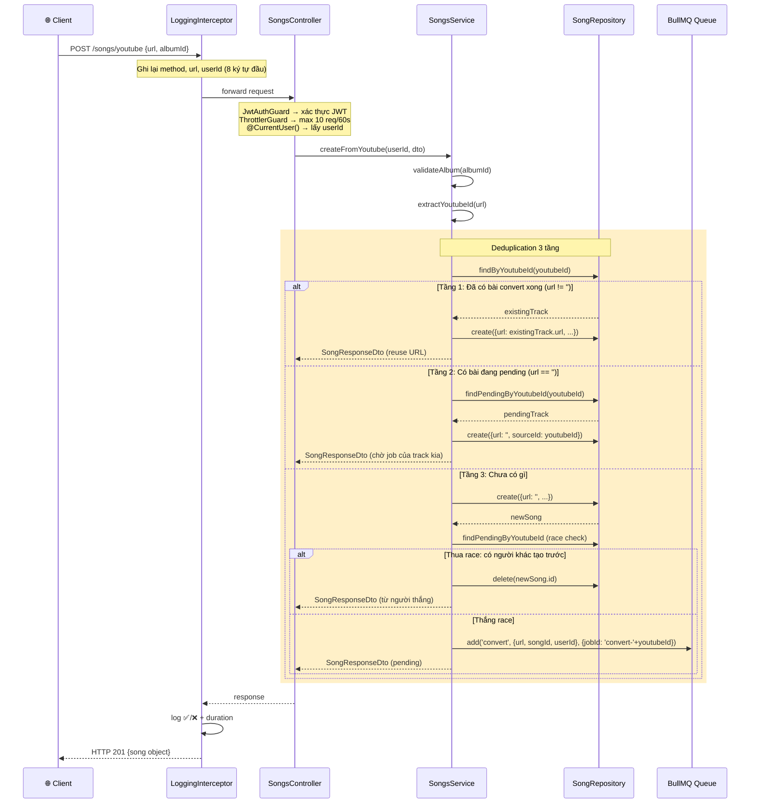
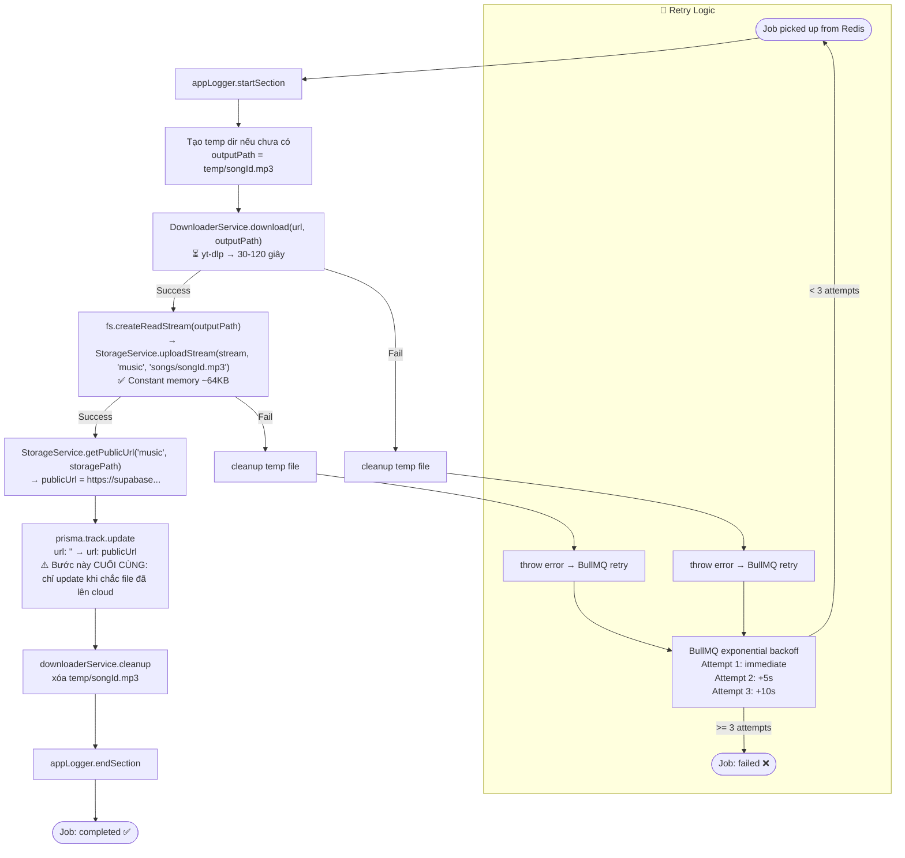
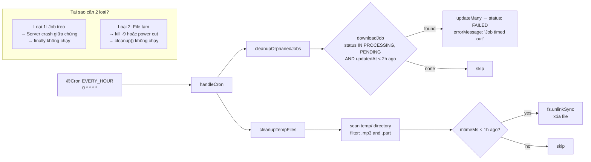
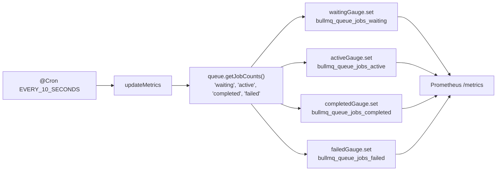
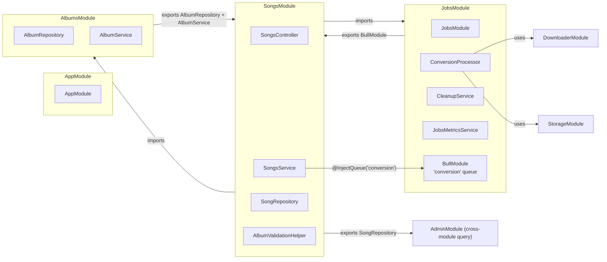
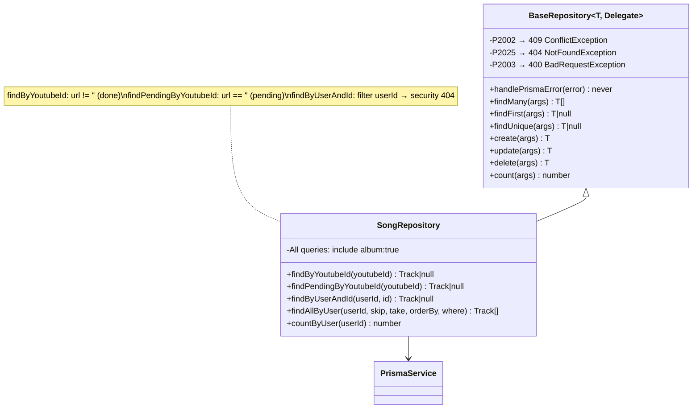

# Songs & Jobs Module — Architecture Diagram

> Dựa trên: `backend/docs/learn/songs/` + `backend/docs/learn/jobs/`

---

## 1. Toàn cảnh hệ thống



---

## 2. HTTP Request Flow — Songs Module



---

## 3. ConversionProcessor Flow — Jobs Module



---

## 4. CleanupService — Scheduled Tasks



---

## 5. JobsMetricsService — Monitoring



---

## 6. Module Dependencies



---

## 7. Database State Machine — Track.url

```mermaid
stateDiagram-v2
    [*] --> PENDING: SongsService.createFromYoutube()\ncreate({url: ''})

    PENDING --> PROCESSING: ConversionProcessor picks up job
    PROCESSING --> COMPLETED: prisma.track.update({url: publicUrl})
    PROCESSING --> FAILED_RETRY: Error thrown → BullMQ retry
    FAILED_RETRY --> PROCESSING: Retry attempt (max 3)
    FAILED_RETRY --> FAILED: Max attempts reached
    FAILED --> CLEANED: CleanupService.cleanupOrphanedJobs()\n> 2h stuck → status=FAILED

    note right of PENDING: url = '' convention\nthay vì cột status riêng
    note right of COMPLETED: url = 'https://supabase...'\nClient có thể play ngay
```

---

## 8. SongRepository — Query Methods



---

## 9. Key Patterns Summary

| Pattern | File | Mục đích |
|---|---|---|
| **Deduplication 3 tầng** | `songs.service.ts` | 1 YouTube URL = 1 job, dù N user request |
| **`url = ''` là pending state** | Toàn module | Tránh thêm cột `status` |
| **Race condition check** | `songs.service.ts` | Tạo record → kiểm tra lại → nếu thua race thì xóa |
| **jobId: `convert-{youtubeId}`** | `songs.service.ts` | BullMQ dedup job level |
| **Streaming upload** | `conversion.processor.ts` | Memory ~64KB bất kể file size |
| **DB update là bước CUỐI** | `conversion.processor.ts` | Consistency: chỉ done khi file đã lên cloud |
| **Promise.all** | `songs.service.ts` | count + findMany chạy song song |
| **Security 404 thay 403** | `songs.service.ts` | Không lộ resource của user khác |
| **BaseRepository generic** | `base.repository.ts` | DRY: xử lý Prisma error 1 lần |
| **CleanupService dual** | `cleanup.service.ts` | Guard 2: dọn orphan job + temp files khi server crash |
| **Prometheus gauge** | `jobs.metrics.ts` | Real-time queue health monitoring |
| **concurrency: 2** | `conversion.processor.ts` | Balance speed vs resource (yt-dlp CPU-heavy) |
