# Backend va Frontend Deep Dive

Tai lieu nay mo ta cach backend hoat dong va cach frontend tuong tac voi backend trong du an music app. Noi dung duoc tong hop tu `.codegraph/codegraph.db`, `backend/.codegraph/codegraph.db`, `frontend/.codegraph/codegraph.db` va source code hien tai.

## 1. Tong Quan He Thong

Du an gom hai phan chinh:

- `backend`: NestJS API server. Backend xu ly auth, album, song, Google Drive import, YouTube conversion, Supabase Storage, BullMQ job queue, Prisma/PostgreSQL va mot so route admin.
- `frontend`: Next.js app. Frontend xu ly giao dien nghe nhac, dang nhap/dang ky, quan ly album, danh sach bai hat, them nhac tu YouTube, import Google Drive, phat nhac bang Howler, offline storage va realtime refresh bang Supabase.

Luon tong quat:

```text
User
  -> Next.js UI
  -> frontend/src/lib/api.ts
  -> NestJS controller
  -> service
  -> repository / Prisma
  -> PostgreSQL
  -> response ve frontend
  -> Zustand store / component state cap nhat UI
```

Mot so luong co xu ly bat dong bo:

```text
Frontend POST /songs/youtube
  -> Backend tao Track voi url rong
  -> Backend day job vao BullMQ queue "conversion"
  -> Worker tai audio bang yt-dlp
  -> Upload len Supabase Storage
  -> Update Track.url trong database
  -> Frontend poll /songs/:id hoac nghe Supabase Realtime
  -> UI hien bai hat da san sang phat
```

## 2. Codegraph Da Ghi Nhan Gi

Backend graph:

- 51 files indexed.
- 375 nodes.
- 604 edges.
- 14 route nodes.
- 0 unresolved refs.

Frontend graph:

- 57 files indexed.
- 309 nodes.
- 498 edges.
- 86 call edges.
- 0 unresolved refs.

Dieu nay cho thay codegraph parse duoc ca hai phia kha sach: khong co unresolved refs, route backend duoc nhan dien, va cac ham frontend goi API chinh duoc map trong graph.

## 3. Backend Bootstrap Va Global Middleware

Backend chay tu `backend/src/main.ts`.

Khi app khoi dong:

1. `NestFactory.create(AppModule, { bufferLogs: true })` tao Nest app.
2. Logger duoc lay tu `nestjs-pino` va gan vao app bang `app.useLogger(app.get(Logger))`.
3. CORS duoc bat voi:
   - `origin: true`, cho phep origin theo request.
   - methods: `GET,HEAD,PUT,PATCH,POST,DELETE,OPTIONS`.
   - `credentials: true`.
   - `allowedHeaders: '*'`.
   - preflight tra `204`.
4. Global exception filter `HttpExceptionFilter` chuan hoa loi HTTP.
5. Global `ValidationPipe` bat:
   - `whitelist: true`: chi giu field co decorator validation.
   - `forbidNonWhitelisted: true`: gui field la bi reject.
   - `transform: true`: convert DTO input theo metadata.
6. Swagger duoc expose tai `/api`.
7. Port lay tu `process.env.PORT`, fallback la `3000`.

Frontend dang mac dinh goi backend qua `NEXT_PUBLIC_API_URL`, fallback `http://localhost:3002`. Vi backend fallback la `3000`, moi truong dev can dam bao `PORT=3002` hoac frontend env phai tro dung port backend.

## 4. Backend Module Wiring

`backend/src/app.module.ts` la root module.

Module import chinh:

- `ConfigModule.forRoot({ isGlobal: true })`: doc env toan app.
- `LoggerModule.forRoot(...)`: Pino logger, dev dung `pino-pretty`.
- `CacheModule.register({ isGlobal: true, ttl: 60000 })`.
- `DownloaderModule`: wrapper cho `yt-dlp`.
- `StorageModule`: Supabase Storage service va cleanup service.
- `JobsModule`: BullMQ queue `conversion` va worker.
- `PrismaModule`: Prisma client service.
- `SongsModule`: songs controller/service/repository.
- `AlbumsModule`: albums controller/service/repository.
- `GoogleDriveModule`: Google Drive list/import.
- `AdminModule`: route admin cleanup/delete.
- `AuthModule`: auth, JWT, current user guard.

Global provider quan trong:

- `APP_INTERCEPTOR -> LoggingInterceptor`: log moi request thanh cong hoac loi voi method, url, query, params, duration, status.

## 5. Backend Data Model

Prisma schema nam o `backend/prisma/schema.prisma`.

`User`:

- `id`: UUID.
- `email`: unique.
- `passwordHash`: bcrypt hash.
- `name`: optional.
- `albums`: relation toi `Album`.

`Album`:

- `id`: UUID.
- `title`, `artist`, `coverUrl`.
- `isDefault`: boolean, default `false`.
- `userId`: owner cua album.
- `user`: relation toi `User`, on delete cascade.
- `tracks`: relation toi `Track`.
- index tren `[userId]` va `[userId, isDefault]`.

`Track`:

- `id`: UUID.
- `title`, `artist`, `url`, `duration`.
- `albumId`: album chua track.
- `sourceType`: vi du `youtube`, `google-drive`.
- `sourceId`: id nguon ngoai, dung cho Google Drive file id.
- `album`: relation toi `Album`, on delete cascade.
- index tren `[albumId]`.

Ownership cua track khong nam truc tiep tren `Track.userId`. Backend suy ra owner cua track thong qua `Track.album.userId`.

## 6. Repository Layer

Backend dung repository wrapper quanh Prisma.

`BaseRepository` co cac method:

- `findMany(args)`
- `findUnique(args)`
- `findFirst(args)`
- `create(args)`
- `update(args)`
- `delete(args)`

Repository cu the:

- `UserRepository`: ke thua base va them `findByEmail(email)`.
- `AlbumRepository`: ke thua base va them:
  - `findByUserAndTitle(userId, title)`
  - `findDefault(userId)`
  - `findByTitleAndArtist(title, artist)`
- `SongRepository`: ke thua base cho Prisma `Track`.

Layer nay giup service khong goi truc tiep tat ca Prisma delegate, nhung hien tai van la wrapper kha mong.

## 7. Auth Backend

Auth module la global module.

`AuthModule`:

- Import `PrismaModule`.
- Dang ky `JwtModule` bang `JWT_SECRET`.
- JWT expiry lay tu `JWT_EXPIRES_IN`, fallback `1d`.
- Export `AuthService`, `JwtAuthGuard`, `JwtModule`.

### POST /auth/register

Controller: `AuthController.register`.

Input DTO:

```ts
{
  email: string;      // IsEmail
  password: string;   // IsString, MinLength(8)
  name?: string;      // optional
}
```

Service flow:

1. Lowercase email.
2. `UserRepository.findByEmail(email)`.
3. Neu ton tai user, throw `409 Conflict` voi message `Email already exists`.
4. Hash password bang `bcrypt.hash(password, 12)`.
5. Tao user voi `email`, `passwordHash`, `name`.
6. Sign JWT payload `{ sub: user.id, email: user.email }`.
7. Tra ve:

```json
{
  "accessToken": "jwt",
  "user": {
    "id": "uuid",
    "email": "user@example.com",
    "name": "User Name"
  }
}
```

### POST /auth/login

Controller: `AuthController.login`.

Input DTO:

```ts
{
  email: string;
  password: string;
}
```

Service flow:

1. Lowercase email.
2. Tim user bang email.
3. Neu khong co user, throw `401 Unauthorized`.
4. Compare password bang `bcrypt.compare`.
5. Neu sai password, throw `401 Unauthorized`.
6. Sign JWT payload `{ sub, email }`.
7. Tra ve cung shape voi register.

### GET /auth/me

Route nay duoc bao ve bang `JwtAuthGuard`.

Guard flow:

1. Doc header `Authorization`.
2. Tach token theo dang `Bearer <token>`.
3. Neu khong co token, throw `401 Authentication token is missing`.
4. Verify token bang `JwtService.verifyAsync`.
5. Gan `request.user = { id: payload.sub, email: payload.email }`.
6. `CurrentUser` decorator lay `request.user` dua vao controller.

Service `me(userId)`:

1. Tim user theo id.
2. Neu khong co user, throw `401`.
3. Tra ve:

```json
{
  "id": "uuid",
  "email": "user@example.com",
  "name": "User Name"
}
```

## 8. Frontend Auth Flow

Frontend auth tap trung o:

- `frontend/src/lib/api.ts`
- `frontend/src/store/useAuthStore.ts`
- `frontend/src/components/auth/AuthGate.tsx`
- `frontend/src/app/[locale]/login/page.tsx`
- `frontend/src/app/[locale]/register/page.tsx`

### API client

`src/lib/api.ts` co:

- `RAW_API_URL = process.env.NEXT_PUBLIC_API_URL ?? 'http://localhost:3002'`.
- `API_URL = RAW_API_URL.replace(/\/$/, '')`.
- Common headers:
  - `Content-Type: application/json`
  - `bypass-tunnel-reminder: true`
  - `ngrok-skip-browser-warning: true`
- `getAuthHeaders(appToken)` them `Authorization: Bearer <token>` neu co token.

### Login/register UI

Login page:

1. User submit email/password.
2. Goi `login({ email, password })`.
3. Neu thanh cong, `useAuthStore.getState().setSession(accessToken, user)`.
4. Redirect ve `/${locale}`.
5. Neu `401`, hien message invalid credentials.

Register page:

1. User submit name/email/password.
2. Goi `register({ name, email, password })`.
3. Neu thanh cong, set session va redirect ve home.
4. Neu `409`, hien message email da ton tai.

### Zustand auth store

`useAuthStore` luu:

- `user`
- `accessToken`
- `isHydrated`
- `hydrate()`
- `setSession(accessToken, user)`
- `clearSession()`

Persist key: `music.auth`.

`setSession`:

1. So sanh `previousUserId` voi user moi.
2. Neu doi user, reset state phu thuoc user:
   - `usePlayerStore.reset()`
   - `useAlbumStore.reset()`
3. Set token + user vao store.
4. Luu JSON `{ accessToken, user }` vao localStorage.

`clearSession`:

1. Clear token/user trong store.
2. Reset player va album state.
3. Remove `music.auth` khoi localStorage.

`hydrate`:

1. Neu server-side, set `isHydrated: true`.
2. Neu client-side, doc `music.auth`.
3. Neu khong co storage, set hydrated.
4. Neu storage loi JSON hoac khong co token, clear session.
5. Neu co token, goi `/auth/me`.
6. Neu `/auth/me` ok, set user moi tu backend.
7. Neu `/auth/me` fail, clear session.

### AuthGate

`AuthGate` boc toan bo localized app trong `src/app/[locale]/layout.tsx`.

Flow:

1. Mount component thi goi `hydrate()`.
2. Khi `isHydrated = false`, hien spinner.
3. Public routes:
   - `/${locale}/login`
   - `/${locale}/register`
4. Neu khong co token va route khong public, redirect login.
5. Neu co token va dang o login/register, redirect home.

Ket qua: frontend khong render protected app truoc khi biet token con valid hay khong.

## 9. Albums Backend

Album routes deu duoc bao ve bang `JwtAuthGuard` o controller class.

Controller: `AlbumController`.

Base path: `/albums`.

### POST /albums

Input:

```json
{
  "title": "Album title",
  "artist": "Artist name",
  "coverUrl": "https://..."
}
```

`CreateAlbumDto`:

- `title`: required string.
- `artist`: optional string.
- `coverUrl`: optional URL.

Flow:

1. Guard verify JWT.
2. `CurrentUser` lay user id.
3. Controller goi `AlbumService.create(user.id, dto)`.
4. Service ghi album voi `...data` va `userId` tu JWT.
5. Response duoc transform qua `AlbumResponseDto`.

Quan trong: frontend khong gui `userId`; backend luon lay owner tu JWT.

### GET /albums

Flow:

1. Guard verify JWT.
2. Service `findAll(user.id)`.
3. Repository query album voi `where: { userId }`.
4. Include `_count.tracks`.
5. Map `_count.tracks` thanh `_count.songs`.
6. Tra ve array album.

Response moi album gom:

```json
{
  "id": "uuid",
  "title": "Album title",
  "artist": "Artist",
  "coverUrl": null,
  "_count": {
    "songs": 3
  }
}
```

### GET /albums/:id

Flow:

1. Guard verify JWT.
2. Service `findOne(user.id, id)`.
3. Query `findFirst({ where: { id, userId } })`.
4. Neu album khong ton tai hoac thuoc user khac, service return `null`.
5. Controller transform null sang response.

Luu y: route khai bao Swagger `404`, nhung implementation hien tai trong `AlbumService.findOne` return `null` thay vi throw `NotFoundException`. Frontend dang xu ly `!album` de hien "khong ton tai hoac khong co quyen".

### Default album

`AlbumService.findOrCreateDefault(userId)` dung khi tao song/import ma user khong chon album.

Flow:

1. Tim album `where: { userId, isDefault: true }`.
2. Neu co, dung album do.
3. Neu khong co, tao album:

```json
{
  "title": "Default",
  "artist": "Various Artists",
  "isDefault": true,
  "userId": "current user id"
}
```

4. Neu gap race condition khi create, tim lai default album roi tra ve neu co.

## 10. Albums Frontend

Album frontend tap trung o:

- `frontend/src/lib/api.ts`
- `frontend/src/store/useAlbumStore.ts`
- `frontend/src/app/[locale]/HomePageClient.tsx`
- `frontend/src/app/[locale]/albums/AlbumsClient.tsx`
- `frontend/src/components/templates/AlbumDetailClient.tsx`

### API functions

`fetchAlbums(appToken, options?)`:

- Goi `GET /albums`.
- Gui `Authorization: Bearer <appToken>`.
- Throw `Failed to fetch albums` neu response khong ok.

`createAlbum(appToken, data)`:

- Goi `POST /albums`.
- Body: `{ title, artist?, coverUrl? }`.
- Gui Authorization header.

`fetchAlbum(appToken, id)`:

- Goi `GET /albums/:id`.
- `cache: 'no-store'`.

### Album store

`useAlbumStore` luu:

- `albums`
- `isLoading`
- `isLoaded`
- `loadAlbums(accessToken?)`
- `setAlbums(albums)`
- `reset()`

`loadAlbums` co guard `if (get().isLoaded) return`, tranh fetch lai neu da load. Nhung mot so component nhu `HomePageClient` va `AlbumsClient` goi truc tiep `fetchAlbums(..., { cache: 'no-store' })` roi `setAlbums(data)` de lay du lieu moi nhat.

### Home page

`HomePageClient`:

1. Lay `accessToken`, `isHydrated`, `clearSession` tu auth store.
2. Khi hydrated va co token, goi `fetchAlbums`.
3. Set albums vao store.
4. Neu loi co dau hieu `401`/unauthorized, clear session va redirect login.
5. Subscribe Supabase Realtime table `Album`; khi co event thi load lai albums.
6. Tinh `totalSongs` tu `_count.songs`.
7. Render album grid.

### Albums page

`AlbumsClient`:

1. Load albums tu backend khi token san sang.
2. Co grid/list mode.
3. Tao album bang modal local state.
4. Submit create:
   - Validate title khong rong.
   - Goi `createAlbum(appToken, { title, artist })`.
   - Append album moi vao Zustand store.
   - Dong modal va clear input.

### Album detail page

`AlbumDetailClient`:

1. Lay `id` tu query page/detail.
2. Khi hydrated va co token:
   - `loadAlbums(appToken)` de co album list.
   - `fetchAlbum(appToken, id)` de lay album detail.
3. Subscribe Realtime table `Album` va `Track`.
4. Render album header.
5. Render `Library` voi `albumId={id}`.

`Library` se lay tat ca tracks tu `/songs`, sau do filter client-side theo `albumId`.

## 11. Songs Backend

Song routes deu duoc bao ve bang `JwtAuthGuard`.

Controller: `SongController`.

Base path: `/songs`.

### POST /songs/youtube

Input:

```json
{
  "url": "https://youtube.com/...",
  "title": "Song title",
  "artist": "Artist",
  "albumId": "optional album uuid"
}
```

`CreateSongYoutubeDto`:

- `url`: required URL.
- `title`: required string.
- `artist`: optional string.
- `albumId`: optional string.

Service flow `SongService.createFromYoutube(userId, url, title, artist?, albumId?)`:

1. Neu co `albumId`:
   - Tim album bang id.
   - Neu khong ton tai hoac `album.userId !== userId`, throw `404 Album not found`.
2. Neu khong co `albumId`:
   - Goi `AlbumService.findOrCreateDefault(userId)`.
   - Dung default album id.
3. Tao track:

```json
{
  "title": "Song title",
  "artist": "Artist",
  "url": "",
  "albumId": "final album id",
  "sourceType": "youtube"
}
```

4. Add BullMQ job vao queue `conversion`:

```json
{
  "url": "youtube url",
  "songId": "track id",
  "userId": "current user id"
}
```

5. Tra ve track vua tao. Luc nay `url` rong, vi file chua convert/upload xong.

### GET /songs

Flow:

1. Guard verify JWT.
2. Query tracks voi ownership thong qua album:

```ts
where: {
  album: {
    userId
  }
}
```

3. Include album.
4. Tra ve list.

### GET /songs/:id

Flow:

1. Guard verify JWT.
2. Query `findFirst` voi:

```ts
where: {
  id,
  album: { userId }
}
```

3. Neu khong co, return `null`.
4. Tra ve song.

Tu goc nhin frontend, endpoint nay duoc dung de poll sau khi bat dau YouTube conversion. Khi `url` bat dau co public URL, frontend xem nhu conversion thanh cong.

### DELETE /songs/:id

Flow:

1. Guard verify JWT.
2. Tim track voi `id` va `album.userId = current user`.
3. Neu khong co, throw `404 Song not found`.
4. Delete track theo id.
5. HTTP status `204`.

Route nay xoa database row, khong thay code xoa file storage lien quan trong song service. Admin storage cleanup la route rieng.

### PATCH /songs/:id/move

Input:

```json
{
  "albumId": "target album uuid"
}
```

Flow:

1. Guard verify JWT.
2. Tim source track voi `id` va `album.userId = current user`.
3. Neu khong co, throw `404 Song not found`.
4. Tim target album bang `albumId`.
5. Neu target album khong ton tai hoac khong thuoc user hien tai, throw `404 Target album not found`.
6. Update track `albumId`.
7. Tra ve track da update.

## 12. YouTube Conversion Worker

Queue module: `backend/src/jobs/jobs.module.ts`.

BullMQ config:

- Redis host: `REDIS_HOST`, fallback `localhost`.
- Redis port: `REDIS_PORT`, fallback `6379`.
- Queue name: `conversion`.

Worker: `ConversionProcessor`.

Khi nhan job:

1. Doc `{ url, songId, userId }`.
2. Tao temp dir `backend/temp` neu chua co.
3. Output path: `temp/<songId>.mp3`.
4. Goi `DownloaderService.download(url, outputPath)`.
5. Upload file len Supabase Storage:
   - bucket: `music`
   - path: `songs/<songId>.mp3`
6. Lay public URL bang `StorageService.getPublicUrl`.
7. Update database:

```ts
prisma.track.update({
  where: { id: songId },
  data: { url: publicUrl }
})
```

8. Cleanup temp file.
9. Return `{ storagePath, publicUrl }`.

Neu loi:

1. Log error voi `songId`, `userId`, `error.message`.
2. Cleanup temp file.
3. Throw lai error de BullMQ danh dau job failed.

`DownloaderService` dung command `yt-dlp`:

```text
yt-dlp -f "bestaudio/best" --extractor-args "youtube:player_client=web" --no-playlist --retries 3 --fragment-retries 3 --socket-timeout 30 -x --audio-format mp3 --audio-quality 320K -o "<outputPath>" "<url>"
```

Neu stderr co:

- `Requested format is not available`: throw loi format unavailable.
- `Video unavailable`: throw loi video private/unavailable.
- Khac: throw `yt-dlp download failed`.

## 13. Songs Frontend

Song frontend tap trung o:

- `frontend/src/lib/api.ts`
- `frontend/src/components/molecules/Downloader/Downloader.tsx`
- `frontend/src/components/molecules/Library/Library.tsx`
- `frontend/src/store/usePlayerStore.ts`
- `frontend/src/components/molecules/PlayerBar.tsx`

### API functions

`downloadFromYoutube(appToken, url, title, artist?, albumId?)`:

- Goi `POST /songs/youtube`.
- Body: `{ url, title, artist, albumId }`.
- Tra ve track vua tao.

`fetchTracks(appToken)`:

- Goi `GET /songs`.
- `cache: 'no-store'`.

`fetchTrack(appToken, id)`:

- Goi `GET /songs/:id`.
- Dung de poll conversion status.

`deleteTrack(appToken, id)`:

- Goi `DELETE /songs/:id`.

`moveTrackToAlbum(appToken, id, albumId)`:

- Goi `PATCH /songs/:id/move`.

### Downloader component

`Downloader` la UI them nhac tu YouTube.

State:

- `url`
- `title`
- `artist`
- `selectedAlbumId`
- `isDownloading`
- `status`

Flow submit:

1. Neu khong co app token, redirect login.
2. Neu thieu url/title, return.
3. Set downloading va status `preparing`.
4. Goi `downloadFromYoutube`.
5. Lay `song.id` tu response.
6. Tao `handleSuccess` de:
   - Set status success.
   - Clear form.
   - Stop loading.
   - Goi callback neu co.
   - Clear status sau 5s.
7. Neu Supabase configured, subscribe table `Track`, filter `id=eq.<songId>`.
8. Khi realtime payload co `updatedSong.url`, xem nhu success.
9. Song song do, set polling fallback:
   - Sau 3s goi `fetchTrack(songId)`.
   - Neu `updatedSong.url` co gia tri, success.
   - Neu chua co, poll lai sau 3s.
   - Neu poll loi auth, clear session va redirect login.
   - Loi khac thi poll lai sau 5s.
10. Timeout 3 phut:
   - Remove realtime channel neu con.
   - Stop loading.
   - Status `Download timed out`.

### Library component

`Library` la list bai hat.

Flow load:

1. Neu auth store chua hydrated, chua fetch.
2. Neu khong co token, stop loading.
3. Goi `fetchTracks(accessToken)`.
4. Neu component nhan `albumId`, filter tracks theo `track.albumId === albumId`.
5. Neu khong co `albumId`, hien tat ca tracks cua user.
6. Subscribe Supabase Realtime table `Track` de reload khi database co thay doi.

Action:

- Play track:
  - Lay local URI neu track da download offline.
  - Goi `usePlayerStore.play(track, localUri?)`.
- Download offline:
  - Goi `useOfflineStorage.downloadTrack(track.id, track.url)`.
- Remove offline:
  - Goi `useOfflineStorage.removeTrack(trackId)`.
- Delete:
  - Confirm bang `window.confirm`.
  - Goi `deleteTrack`.
  - Reload tracks.
- Move:
  - Hien `window.prompt` lay target album id.
  - Goi `moveTrackToAlbum`.
  - Reload tracks.

### Player store va PlayerBar

`usePlayerStore` dung Howler:

- `currentTrack`
- `isPlaying`
- `howl`
- `duration`
- `currentTime`
- `play`
- `pause`
- `resume`
- `togglePlay`
- `seek`
- `reset`

`play(track, localUrl?)`:

1. Neu dang co Howl cu, unload.
2. Chon `playUrl = localUrl || track.url`.
3. Tao `new Howl({ src: [playUrl], html5: true, format: ['mp3'] })`.
4. On load: set duration.
5. On play: set playing va start timer cap nhat currentTime moi giay.
6. On pause/stop/end: stop timer va set state phu hop.
7. Goi `newHowl.play()`.

`PlayerBar` chi render khi co `currentTrack`. No hien title/artist, play/pause, progress range va seek.

## 14. Google Drive Backend

Controller: `GoogleDriveController`.

Base path: `/google-drive`.

Tat ca route trong controller duoc bao ve bang `JwtAuthGuard`.

### GET /google-drive/ping

Tra ve debug object:

```json
{
  "status": "ok",
  "timestamp": "ISO timestamp",
  "version": "2.0-debug"
}
```

### GET /google-drive/files?token=<googleAccessToken>

Input:

- App JWT trong `Authorization: Bearer <appToken>`.
- Google access token nam tren query `token`.

Flow:

1. Guard verify app JWT.
2. Controller goi `GoogleDriveService.listFiles(token)`.
3. Service set OAuth credential `{ access_token }`.
4. Goi Google Drive API `drive.files.list`.
5. Query file:
   - `trashed = false`
   - mime type audio
   - shortcut
   - `video/mp4`
   - support all drives/shared drives.
6. Filter them theo:
   - mime co `audio`, `mpeg`, `flac`, `wav`.
   - filename ket thuc `.mp3`, `.wav`, `.flac`, `.m4a`, `.mp4`.
   - shortcut tro toi audio.
7. Shortcut co `targetId` se duoc resolve thanh target file id.
8. Tra ve list file.

Neu loi, controller khong throw truc tiep ma return object:

```json
{
  "error": true,
  "message": "error message",
  "details": {}
}
```

Frontend `DrivePicker` co check `(files as any)?.error` de hien loi.

### POST /google-drive/import

Input body:

```json
{
  "fileId": "google drive file id",
  "accessToken": "google access token",
  "albumId": "optional album id"
}
```

Flow:

1. Guard verify app JWT.
2. Neu co `albumId`, verify album ton tai va thuoc current user.
3. Neu khong co `albumId`, tao/lay default album.
4. Goi `getFileMetadata(accessToken, fileId)`.
5. Goi `downloadFile(accessToken, fileId)` de lay stream.
6. Sanitize filename de dung lam storage path:
   - Normalize unicode.
   - Bo dau tieng Viet.
   - Ky tu khac `[a-zA-Z0-9.-]` thay bang `_`.
7. Storage path:

```text
songs/<albumId>/<timestamp>_<sanitizedName>
```

8. Upload stream vao Supabase Storage bucket `music`.
9. Lay public URL.
10. Tao track:

```json
{
  "title": "original file name without extension",
  "artist": "Unknown Artist",
  "url": "public storage url",
  "albumId": "final album id",
  "sourceType": "google-drive",
  "sourceId": "fileId"
}
```

Google Drive import khong di qua BullMQ conversion. File duoc download/upload ngay trong request.

## 15. Google Drive Frontend

Frontend pieces:

- `frontend/src/hooks/useGoogleDrive.ts`
- `frontend/src/components/google-drive/DrivePicker.tsx`
- `frontend/src/lib/api.ts`

`useGoogleDrive`:

1. Inject script `https://accounts.google.com/gsi/client` neu chua co.
2. `login()` khoi tao Google token client bang `NEXT_PUBLIC_GOOGLE_CLIENT_ID`.
3. Scope: `https://www.googleapis.com/auth/drive.readonly`.
4. Goi `requestAccessToken({ prompt: 'consent' })`.
5. Luu `accessToken` cua Google vao hook state.
6. `listFiles(appToken, googleAccessToken)` goi backend `fetchGoogleDriveFiles`.

`DrivePicker`:

1. Nhan `googleToken`, `files`, `albums`, `albumId`.
2. User search va chon nhieu file.
3. User chon album dich.
4. `handleImport` validate:
   - Co Google token.
   - Co app token.
   - Co file selected.
   - Co selected album.
5. Loop tung file id:
   - Goi `importFromDrive(appToken, fileId, googleToken, selectedAlbumId)`.
   - Cap nhat import progress.
6. Khi xong, goi `onImportComplete` va dong modal.

## 16. Storage Backend

`StorageService` la adapter cho Supabase Storage.

Config:

- `SUPABASE_URL`
- `SUPABASE_KEY`

Neu config invalid, service van tao Supabase client voi placeholder URL/key de tranh crash luc init, nhung se log error.

Methods:

- `upload(filePath, bucketName, destinationPath)`: doc file tu disk, upload buffer voi content type `audio/mpeg`, `upsert: true`.
- `uploadBuffer(buffer, bucketName, destinationPath, contentType)`: upload buffer.
- `uploadStream(stream, bucketName, destinationPath, contentType)`: upload stream.
- `getPublicUrl(bucketName, path)`: lay public URL tu Supabase.
- `delete(bucketName, path)`: remove file.

`StorageCleanupService` inject `IStorageProvider` va goi `delete`.

## 17. Admin Backend

Admin routes nam o `AdminController`.

Luu y quan trong: admin controller hien tai khong co `JwtAuthGuard` trong source code doc duoc. Hai route nay co the goi duoc neu server expose ra ngoai.

### DELETE /admin/tracks/:id

Flow:

1. Lay `id` tu path.
2. Goi `songRepository.delete({ where: { id } })`.
3. Xoa track theo id, khong check ownership va khong cleanup storage.

### POST /admin/storage/cleanup

Input:

```json
{
  "bucketName": "music",
  "path": "songs/..."
}
```

Flow:

1. Goi `storageCleanupService.cleanupFile(bucketName, path)`.
2. Cleanup service goi storage provider `delete`.
3. Tra ve:

```json
{
  "message": "Storage cleanup initiated",
  "file": "path"
}
```

## 18. Frontend App Layout Va Routing

Frontend la Next.js app router.

Root:

- `src/app/layout.tsx`: global HTML/body, font, metadata.
- `src/app/page.tsx`: client redirect ve `/en`.

Localized layout:

- `src/app/[locale]/layout.tsx`.
- Generate static params cho `en` va `vi`.
- Load messages bang `getMessages()`.
- Boc children bang:
  - `NextIntlClientProvider`
  - `AuthGate`
  - mobile container max width 430px
  - `PlayerBar`
  - `BottomTabBar`

`NavWrapper` an player/navigation o public routes login/register.

Main routes:

- `/${locale}`: home album overview.
- `/${locale}/albums`: albums list/create.
- `/${locale}/albums/detail?id=<albumId>`: album detail.
- `/${locale}/music`: add music from YouTube.
- `/${locale}/login`: login.
- `/${locale}/register`: register.

## 19. Frontend API Contract Table

| Frontend function | HTTP | Backend route | Auth | Main consumer |
| --- | --- | --- | --- | --- |
| `register` | `POST` | `/auth/register` | No | Register page |
| `login` | `POST` | `/auth/login` | No | Login page |
| `fetchMe` | `GET` | `/auth/me` | Yes | `useAuthStore.hydrate` |
| `fetchAlbums` | `GET` | `/albums` | Yes | Home, Albums, Album store |
| `createAlbum` | `POST` | `/albums` | Yes | Albums page |
| `fetchAlbum` | `GET` | `/albums/:id` | Yes | Album detail |
| `fetchTracks` | `GET` | `/songs` | Yes | Library |
| `fetchTrack` | `GET` | `/songs/:id` | Yes | Downloader polling |
| `downloadFromYoutube` | `POST` | `/songs/youtube` | Yes | Downloader |
| `deleteTrack` | `DELETE` | `/songs/:id` | Yes | Library |
| `moveTrackToAlbum` | `PATCH` | `/songs/:id/move` | Yes | Library |
| `fetchGoogleDriveFiles` | `GET` | `/google-drive/files?token=...` | Yes + Google token | `useGoogleDrive` |
| `importFromDrive` | `POST` | `/google-drive/import` | Yes + Google token | `DrivePicker` |

## 20. Ownership Va Security Contract

Backend ownership rule:

- Album owner la `Album.userId`.
- Track owner duoc suy ra qua `Track.album.userId`.
- Frontend khong nen gui `userId`.
- Moi protected route dung app JWT de xac dinh current user.

Backend enforcement:

- `POST /albums`: gan `userId` tu JWT.
- `GET /albums`: filter `where: { userId }`.
- `GET /albums/:id`: filter `where: { id, userId }`.
- `POST /songs/youtube`: verify target album thuoc user, hoac tao default album cua user.
- `GET /songs`: filter qua `album.userId`.
- `GET /songs/:id`: filter qua `album.userId`.
- `DELETE /songs/:id`: chi xoa track neu track thuoc user.
- `PATCH /songs/:id/move`: verify ca source track va target album thuoc user.
- `POST /google-drive/import`: verify target album thuoc user, hoac tao default album cua user.

Frontend enforcement:

- Protected components chi fetch sau khi `isHydrated && accessToken`.
- Moi API protected dung `getAuthHeaders(appToken)`.
- Khi gap auth error, nhieu component goi `clearSession()` va redirect login.

Luu y thuc te: `src/lib/api.ts` hien throw message chung nhu `Failed to fetch albums`, nen mot so component check `err.message.includes('401')` co the khong bat duoc 401 neu API helper khong dua status vao message. Auth hydration van an toan hon vi `fetchMe` fail thi clear session.

## 21. Realtime Interaction

Frontend dung Supabase Realtime de refresh UI khi database thay doi.

Setup:

- `frontend/src/lib/supabase.ts` tao client tu:
  - `NEXT_PUBLIC_SUPABASE_URL`
  - `NEXT_PUBLIC_SUPABASE_ANON_KEY`
- Neu config invalid, tao placeholder client va `isConfigured = false`.

Hook `useSupabaseRealtime(table, callback)`:

1. Neu khong co table, Supabase chua configured, hoac client missing thi return.
2. Tao channel name random `realtime:<table>:<random>`.
3. Subscribe `postgres_changes`:
   - event: `*`
   - schema: `public`
   - table: input table.
4. Khi co payload, goi callback moi nhat qua ref.
5. Cleanup bang `supabase.removeChannel(channel)`.

Noi dung dang subscribe:

- Home: table `Album`, reload albums.
- Album detail: table `Album` va `Track`, reload album.
- Library: table `Track`, reload tracks.
- Downloader: subscribe rieng table `Track` filter theo `id=eq.<songId>` de biet conversion xong.

Realtime la optional. Neu Supabase frontend env khong configured, app van dung polling/fetch fallback.

## 22. Offline Playback

Offline playback khong di qua backend sau khi da co `track.url`.

Flow:

1. `Library` render nut download.
2. User click download.
3. `useOfflineStorage.downloadTrack(track.id, track.url)` tai file tu public URL.
4. Track id duoc luu vao danh sach offline.
5. Khi user play:
   - `getLocalUri(track.id)` tra local URI neu co.
   - `usePlayerStore.play(track, localUri)` phat local file.
   - Neu khong co local URI, phat `track.url` remote.

Backend chi can cung cap URL public hop le tren track.

## 23. Error Handling

Backend:

- ValidationPipe reject input sai schema.
- `HttpExceptionFilter` chuan hoa loi thanh:

```json
{
  "statusCode": 401,
  "message": "Invalid or expired token",
  "timestamp": "ISO timestamp",
  "path": "/songs"
}
```

- `LoggingInterceptor` log request success/error.

Frontend:

- API helpers throw `Error(...)` neu `res.ok` false.
- Login/register co message rieng cho `401` va `409`.
- Protected pages/components thuong clear session neu loi co message chua `401` hoac `Unauthorized`.
- Auth hydration la diem verify token chinh: token invalid se bi remove khoi localStorage.

## 24. Cac Luong Chinh End-to-End

### Dang ky

```text
Register page
  -> register(data)
  -> POST /auth/register
  -> AuthService.register
  -> UserRepository.findByEmail
  -> bcrypt.hash
  -> UserRepository.create
  -> JwtService.sign
  -> AuthResponse
  -> useAuthStore.setSession
  -> localStorage music.auth
  -> redirect /<locale>
```

### Refresh app voi token cu

```text
App mount
  -> AuthGate
  -> useAuthStore.hydrate
  -> localStorage music.auth
  -> fetchMe(accessToken)
  -> GET /auth/me
  -> JwtAuthGuard verify
  -> AuthService.me
  -> set accessToken/user/isHydrated
  -> render protected app
```

Neu token invalid:

```text
GET /auth/me fails
  -> hydrate catches error
  -> clearSession
  -> remove localStorage music.auth
  -> AuthGate redirects login
```

### Xem album home

```text
HomePageClient
  -> wait isHydrated && accessToken
  -> fetchAlbums(accessToken, no-store)
  -> GET /albums
  -> JwtAuthGuard
  -> AlbumService.findAll(user.id)
  -> AlbumRepository.findMany where userId
  -> map _count.tracks to _count.songs
  -> setAlbums
  -> render album grid
```

### Tao album

```text
AlbumsClient create modal
  -> createAlbum(accessToken, { title, artist })
  -> POST /albums
  -> JwtAuthGuard
  -> AlbumService.create(user.id, dto)
  -> AlbumRepository.create data includes userId
  -> AlbumResponseDto
  -> frontend append album into useAlbumStore
```

### Them bai hat tu YouTube

```text
Downloader submit
  -> downloadFromYoutube(accessToken, url, title, artist, albumId?)
  -> POST /songs/youtube
  -> JwtAuthGuard
  -> SongService.createFromYoutube
  -> verify album or create default album
  -> SongRepository.create Track with url=""
  -> conversionQueue.add("convert", { url, songId, userId })
  -> frontend receives songId
  -> frontend subscribes Track realtime and starts polling /songs/:id
```

Worker:

```text
BullMQ conversion job
  -> ConversionProcessor.process
  -> DownloaderService.download via yt-dlp
  -> StorageService.upload to Supabase bucket music
  -> StorageService.getPublicUrl
  -> prisma.track.update({ url: publicUrl })
  -> cleanup temp mp3
```

Frontend completion:

```text
Track.url updated
  -> Supabase Realtime event or polling fetchTrack sees url
  -> Downloader success state
  -> Library realtime reloads tracks
  -> User can play track via Howler
```

### Xem library

```text
Library
  -> wait auth hydrated
  -> fetchTracks(accessToken)
  -> GET /songs
  -> JwtAuthGuard
  -> SongService.findAll(user.id)
  -> Query tracks where album.userId = user.id
  -> include album
  -> frontend optionally filters by albumId
  -> render track rows
```

### Xoa bai hat

```text
Library delete button
  -> window.confirm
  -> deleteTrack(accessToken, track.id)
  -> DELETE /songs/:id
  -> JwtAuthGuard
  -> SongService.remove(user.id, id)
  -> verify track belongs to user through album
  -> SongRepository.delete
  -> frontend reload tracks
```

### Move bai hat sang album khac

```text
Library move button
  -> prompt target album id
  -> moveTrackToAlbum(accessToken, track.id, albumId)
  -> PATCH /songs/:id/move
  -> JwtAuthGuard
  -> verify source track belongs to user
  -> verify target album belongs to user
  -> update track.albumId
  -> frontend reload tracks
```

### Import Google Drive

```text
useGoogleDrive.login
  -> Google Identity Services popup
  -> Google access token
  -> useGoogleDrive.listFiles(appToken, googleToken)
  -> GET /google-drive/files?token=<googleToken>
  -> JwtAuthGuard verifies app token
  -> GoogleDriveService.listFiles
  -> frontend receives audio file candidates
```

```text
DrivePicker import selected files
  -> importFromDrive(appToken, fileId, googleToken, selectedAlbumId)
  -> POST /google-drive/import
  -> JwtAuthGuard
  -> verify selected album belongs to user
  -> GoogleDriveService.getFileMetadata
  -> GoogleDriveService.downloadFile
  -> StorageService.uploadStream
  -> StorageService.getPublicUrl
  -> SongRepository.create sourceType="google-drive"
  -> onImportComplete
```

## 25. Runtime Dependencies

Backend can hoat dong dung khi co:

- PostgreSQL `DATABASE_URL`.
- `JWT_SECRET`.
- Redis cho BullMQ conversion queue.
- `yt-dlp` installed tren host backend.
- Supabase backend env:
  - `SUPABASE_URL`
  - `SUPABASE_KEY`
- Google Drive backend env:
  - `GOOGLE_CLIENT_ID`
  - `GOOGLE_CLIENT_SECRET`
  - `GOOGLE_REDIRECT_URI`

Frontend can:

- `NEXT_PUBLIC_API_URL`.
- `NEXT_PUBLIC_SUPABASE_URL`.
- `NEXT_PUBLIC_SUPABASE_ANON_KEY`.
- `NEXT_PUBLIC_GOOGLE_CLIENT_ID`.

Neu Supabase frontend env thieu, realtime se khong subscribe nhung fetch/poll van co the chay.

## 26. Diem Can Luu Y Khi Bao Tri

1. Frontend API helper dang throw message chung, nen component check `401` bang `err.message.includes('401')` co the khong reliable.
2. `GET /albums/:id` va `GET /songs/:id` trong service return `null` khi not found thay vi throw `404`, trong khi Swagger ghi `404`.
3. Admin routes hien khong co auth guard trong controller.
4. Delete song chi xoa DB row, chua thay cleanup storage file trong song service.
5. YouTube conversion phu thuoc Redis, yt-dlp va Supabase Storage; neu mot trong ba phan nay fail, track co the ton tai voi `url=""`.
6. Google Drive import download/upload ngay trong HTTP request, nen file lon co the lam request lau hon YouTube flow.
7. Default album chi co index `[userId, isDefault]`, chua thay unique constraint trong schema hien tai. Service co xu ly race bang retry find, nhung DB khong ep unique default album.
8. Frontend `Library` khi vao album detail fetch tat ca songs roi filter client-side. Neu library lon, nen them API filter theo album trong tuong lai.

## 27. Mental Model Ngan Gon

Backend la source of truth cho:

- Identity va JWT session.
- Ownership cua album/song.
- Tao va truy van album/song.
- Conversion/import thanh public audio URL.
- Storage upload/public URL.

Frontend la orchestration layer cho:

- Auth hydration va redirect.
- Goi REST API qua `src/lib/api.ts`.
- Cache UI state bang Zustand.
- Subscribe realtime de refresh.
- Poll conversion fallback.
- Phat nhac bang Howler.
- Luu offline copy tren client.

Duong bien quan trong nhat giua hai phia la `src/lib/api.ts`. Moi thay doi backend contract nen duoc doi chieu voi file nay, sau do xem cac consumer: auth pages, `AuthGate`, `HomePageClient`, `AlbumsClient`, `AlbumDetailClient`, `Downloader`, `Library`, `DrivePicker`.

## 28. System Design Tong The

Hinh tong quan don gian:

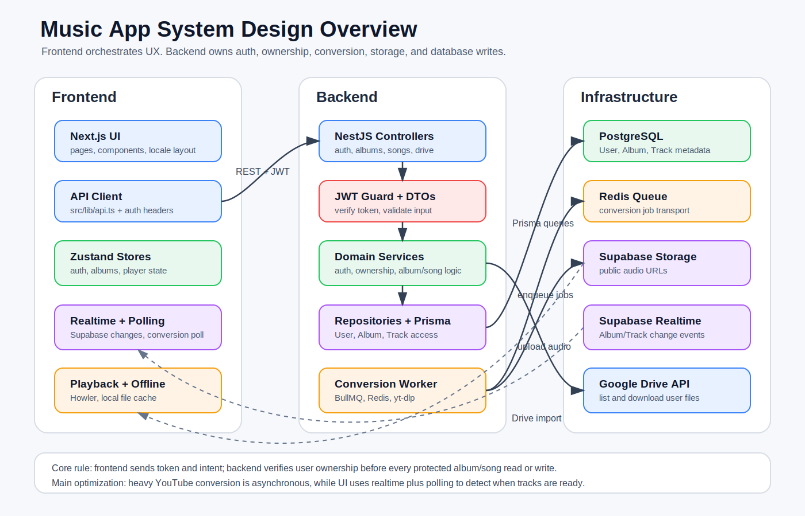

Thu muc SVG chi tiet:

- `docs/diagrams/usecase-overview.svg`
- `docs/diagrams/album-song-usecases.svg`
- `docs/diagrams/database-erd.svg`
- `docs/diagrams/backend-components.svg`
- `docs/diagrams/frontend-components.svg`
- `docs/diagrams/auth-lifecycle.svg`
- `docs/diagrams/youtube-track-lifecycle.svg`
- `docs/diagrams/google-drive-lifecycle.svg`
- `docs/diagrams/realtime-lifecycle.svg`
- `docs/diagrams/playback-offline-lifecycle.svg`
- `docs/diagrams/auth-sequence.svg`
- `docs/diagrams/data-flow-boundaries.svg`

System design cua project hien tai co the nhin nhu 5 lop:

```text
Presentation Layer
  Next.js App Router, React components, pages theo locale

Client Orchestration Layer
  Zustand stores, API helpers, AuthGate, Supabase realtime hooks, offline hooks

Backend API Layer
  NestJS controllers, guards, DTO validation, exception filter, logging interceptor

Domain/Application Layer
  AuthService, AlbumService, SongService, GoogleDriveService, StorageService, DownloaderService

Infrastructure Layer
  PostgreSQL/Prisma, Redis/BullMQ, Supabase Storage, Supabase Realtime, Google Drive API, yt-dlp
```

Diagram tong quan:

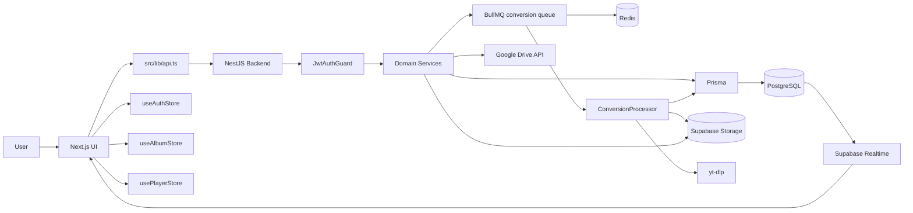
```mermaid
flowchart LR
  User[User]
  UI[Next.js UI]
  APIClient[src/lib/api.ts]
  AuthStore[useAuthStore]
  AlbumStore[useAlbumStore]
  PlayerStore[usePlayerStore]
  Backend[NestJS Backend]
  Guard[JwtAuthGuard]
  Services[Domain Services]
  Prisma[Prisma]
  DB[(PostgreSQL)]
  Redis[(Redis)]
  Queue[BullMQ conversion queue]
  Worker[ConversionProcessor]
  Storage[(Supabase Storage)]
  Realtime[Supabase Realtime]
  Google[Google Drive API]
  YTDLP[yt-dlp]

  User --> UI
  UI --> APIClient
  UI --> AuthStore
  UI --> AlbumStore
  UI --> PlayerStore
  APIClient --> Backend
  Backend --> Guard
  Guard --> Services
  Services --> Prisma
  Prisma --> DB
  Services --> Queue
  Queue --> Redis
  Queue --> Worker
  Worker --> YTDLP
  Worker --> Storage
  Worker --> Prisma
  Services --> Google
  Services --> Storage
  DB --> Realtime
  Realtime --> UI
```

Y tuong chinh cua thiet ke:

- Frontend khong tu quyet ownership. No chi gui token va input nghiep vu. Backend quyet dinh user nao duoc doc/ghi album/song nao.
- Moi protected request di qua JWT guard. Dieu nay bien `Authorization: Bearer <token>` thanh `request.user`.
- Domain logic nam trong service. Controller mong, chi lay input/current user va goi service.
- Repository layer boc Prisma de gom data access pattern.
- Cong viec nang nhu YouTube conversion khong nam trong HTTP request lau dai, ma day qua queue.
- UI khong phu thuoc 100% vao realtime. Realtime co thi nhanh hon, khong co thi polling/fetch van chay.
- Playback nam o client. Backend chi can tao public audio URL.

## 29. System Design Giup Toi Uu Cai Gi

| Design choice | No nam o dau | Giup toi uu cai gi | Ly do | Tradeoff hien tai |
| --- | --- | --- | --- | --- |
| JWT stateless auth | `AuthModule`, `JwtAuthGuard`, `useAuthStore` | Giam DB lookup moi request | Guard verify token truc tiep, khong can session table | Neu token bi lo, can doi secret hoac co blacklist moi revoke ngay duoc |
| `AuthGate` hydration truoc render protected UI | `frontend/src/components/auth/AuthGate.tsx` | Giam flicker va tranh fetch sai luc | UI doi localStorage va `/auth/me` xong moi render protected pages | Lan dau load phai doi verify token |
| Backend ownership qua `Album.userId` va `Track.album.userId` | `AlbumService`, `SongService` | Bao mat multi-user | Frontend khong gui `userId`, backend filter theo current user | Query song phai join/filter qua album |
| DTO validation + whitelist | `backend/src/main.ts` | Giam input rac va spoof field | Field ngoai DTO bi reject | Can khai bao DTO day du, neu quen field se bi reject |
| Thin controller, service chua logic | Controllers va services | De test va bao tri | Controller chi route, service xu ly nghiep vu | Service co the phinh neu them nhieu feature |
| BullMQ conversion queue | `JobsModule`, `ConversionProcessor` | Giam timeout HTTP va tach viec nang | API tao track nhanh, worker xu ly tai/upload sau | Can Redis va worker healthy |
| Supabase Storage public URL | `StorageService` | Don gian hoa playback | Frontend phat URL truc tiep bang Howler | Public URL can policy storage dung |
| Supabase Realtime optional | `useSupabaseRealtime` | UI cap nhat nhanh khi DB doi | Track update xong thi UI co event reload | Can Supabase realtime configured; khong filter theo user trong hook chung |
| Polling fallback cho conversion | `Downloader` | Tang do tin cay UX | Neu realtime khong co, app van poll `/songs/:id` | Polling tao them request |
| Zustand store tach auth/album/player | `src/store/*` | Giam prop drilling va reset user-scoped state de hon | Auth clear se reset album/player | Store hien chua persist album/player, reload phai fetch lai |
| Offline storage o client | `useOfflineStorage`, `Library`, `PlayerStore` | Giam network khi nghe lai | Track da download se phat local URI | Can quan ly dung luong client |
| API client tap trung | `frontend/src/lib/api.ts` | Doi backend contract de kiem soat hon | Moi endpoint co helper rieng | Error shape/status hien chua du giau |
| Default album lazy creation | `AlbumService.findOrCreateDefault` | Giam friction khi them nhac | User co the convert/import khong can tao album truoc | DB chua unique constraint cho default album |
| `cache: no-store` o data can realtime | API helpers/components | Giam stale data | Album/song list lay moi khi reload | Mat loi ich cache cua Next/fetch |
| Logging interceptor | `LoggingInterceptor` | Debug request nhanh hon | Log method/url/params/duration/status | Body khong log de tranh lo data, can trace id neu production |

Ket luan thiet ke:

- Project dang toi uu cho user-private music library, khong phai public catalog lon.
- Uu tien dung va ro ownership hon la cache phuc tap.
- Uu tien UX cap nhat nhanh bang realtime + polling hon la bat user refresh tay.
- Uu tien tach viec nang sang worker cho YouTube conversion.
- Uu tien frontend mobile-width app va client playback.

## 30. Use Case Diagram Tong The

SVG render san:

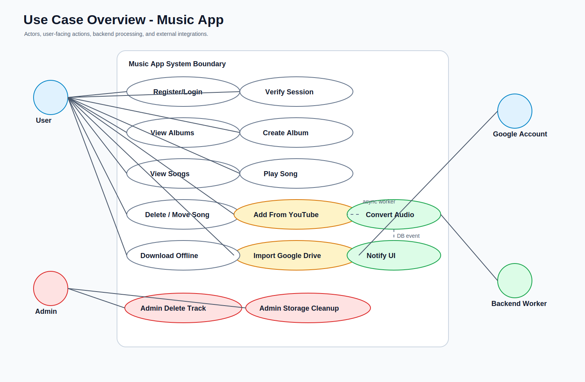

Mermaid khong co use-case diagram native nhu UML, nen diagram duoi dung flowchart voi actor va use case.

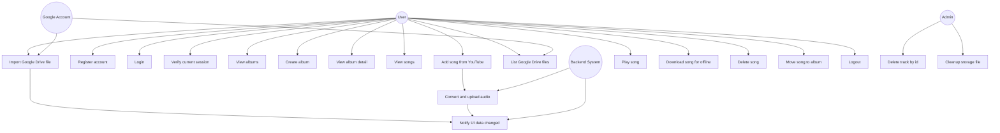
```mermaid
flowchart TB
  User((User))
  GoogleUser((Google Account))
  Admin((Admin))
  System((Backend System))

  UCRegister[Register account]
  UCLogin[Login]
  UCMe[Verify current session]
  UCViewAlbums[View albums]
  UCCreateAlbum[Create album]
  UCViewAlbum[View album detail]
  UCViewSongs[View songs]
  UCYoutube[Add song from YouTube]
  UCDriveList[List Google Drive files]
  UCDriveImport[Import Google Drive file]
  UCPlay[Play song]
  UCOffline[Download song for offline]
  UCDelete[Delete song]
  UCMove[Move song to album]
  UCLogout[Logout]
  UCAdminDelete[Delete track by id]
  UCAdminCleanup[Cleanup storage file]
  UCConvert[Convert and upload audio]
  UCRealtime[Notify UI data changed]

  User --> UCRegister
  User --> UCLogin
  User --> UCMe
  User --> UCViewAlbums
  User --> UCCreateAlbum
  User --> UCViewAlbum
  User --> UCViewSongs
  User --> UCYoutube
  User --> UCDriveList
  User --> UCDriveImport
  User --> UCPlay
  User --> UCOffline
  User --> UCDelete
  User --> UCMove
  User --> UCLogout

  GoogleUser --> UCDriveList
  GoogleUser --> UCDriveImport

  Admin --> UCAdminDelete
  Admin --> UCAdminCleanup

  UCYoutube --> UCConvert
  UCDriveImport --> UCRealtime
  UCConvert --> UCRealtime
  System --> UCConvert
  System --> UCRealtime
```

## 31. Use Case Detail Theo Tung Phan

SVG render san cho album/song:

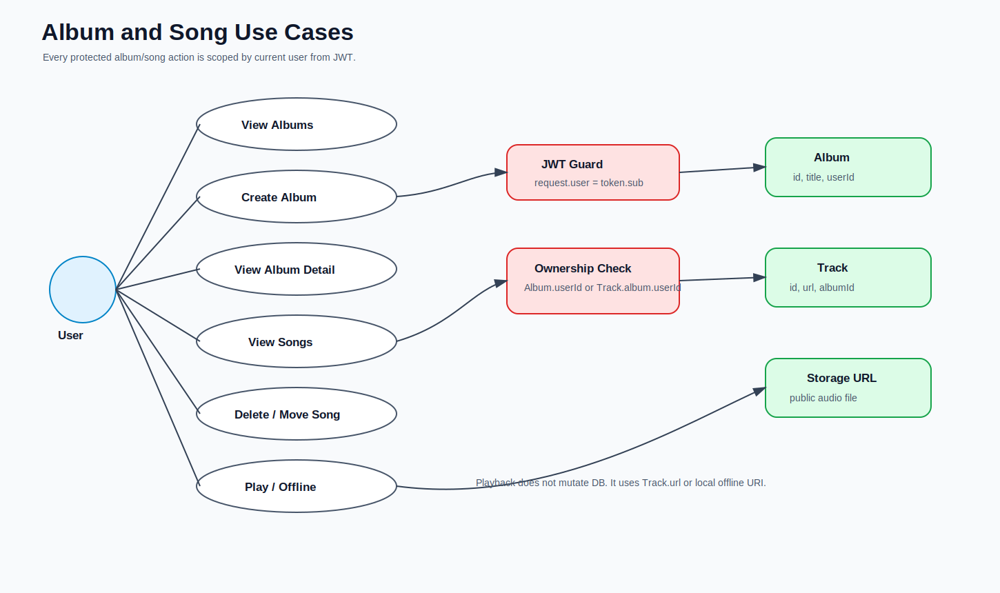

### Auth use cases

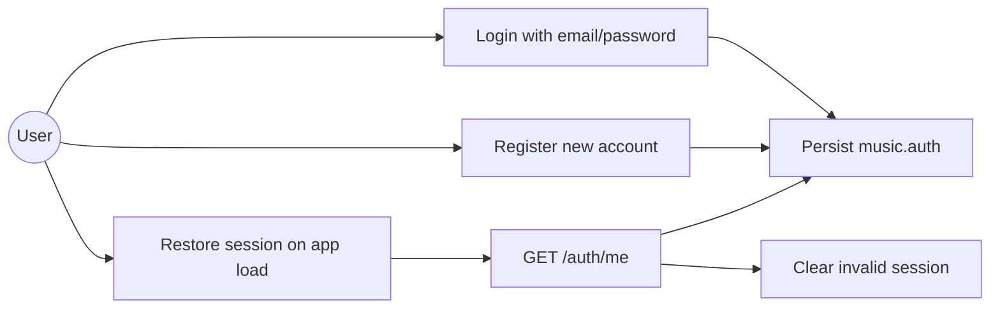
```mermaid
flowchart LR
  User((User))
  Login[Login with email/password]
  Register[Register new account]
  Hydrate[Restore session on app load]
  Verify[GET /auth/me]
  Store[Persist music.auth]
  Clear[Clear invalid session]

  User --> Login
  User --> Register
  User --> Hydrate
  Login --> Store
  Register --> Store
  Hydrate --> Verify
  Verify --> Store
  Verify --> Clear
```

Auth giup he thong:

- Dam bao moi album/song request co current user.
- Cho phep frontend refresh trang ma van giu session.
- Cho phep reset user-scoped state khi logout hoac doi user.

### Album use cases

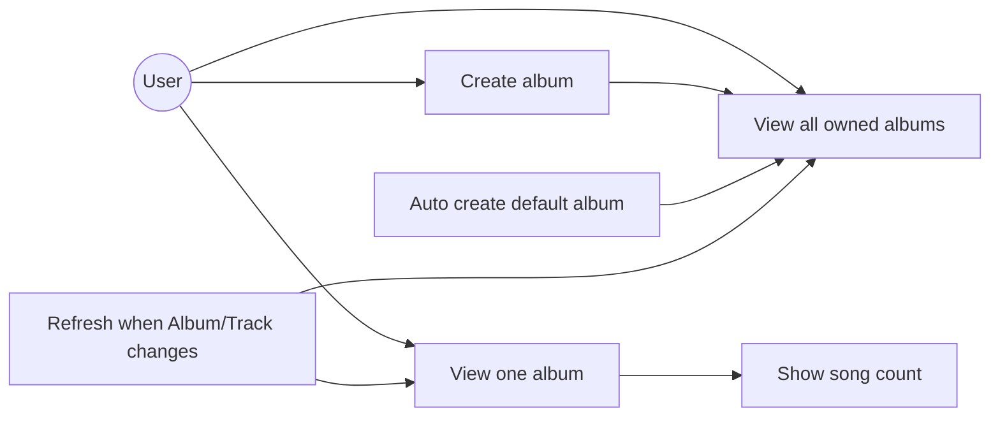
```mermaid
flowchart LR
  User((User))
  ViewAll[View all owned albums]
  Create[Create album]
  Detail[View one album]
  Default[Auto create default album]
  Count[Show song count]
  Realtime[Refresh when Album/Track changes]

  User --> ViewAll
  User --> Create
  User --> Detail
  Create --> ViewAll
  Detail --> Count
  Default --> ViewAll
  Realtime --> ViewAll
  Realtime --> Detail
```

Album design giup:

- Tach library cua tung user.
- Tao album rieng khi user muon to chuc nhac.
- Tu tao default album de luong import/convert khong bi chan.
- Dem so bai tren album bang `_count`.

### Song/library use cases

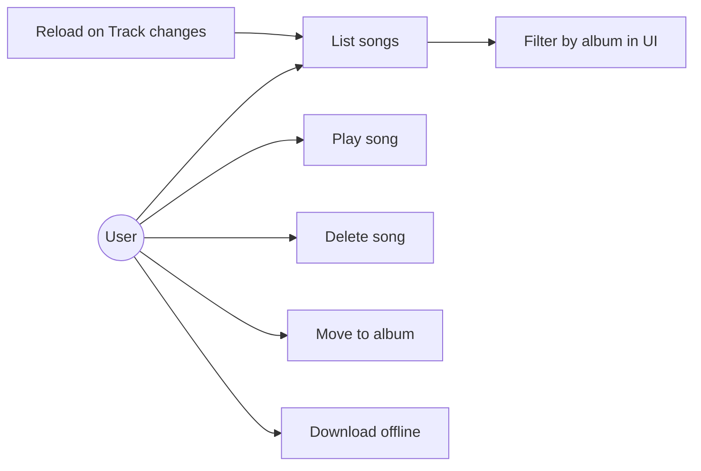
```mermaid
flowchart LR
  User((User))
  ListSongs[List songs]
  FilterAlbum[Filter by album in UI]
  Play[Play song]
  Delete[Delete song]
  Move[Move to album]
  Offline[Download offline]
  Realtime[Reload on Track changes]

  User --> ListSongs
  ListSongs --> FilterAlbum
  User --> Play
  User --> Delete
  User --> Move
  User --> Offline
  Realtime --> ListSongs
```

Song design giup:

- Moi list song deu scope theo `album.userId`.
- User co the thao tac track ma khong can frontend biet database relation phuc tap.
- Player chi can track object co `url`.

### YouTube conversion use cases


```mermaid
flowchart LR
  User((User))
  Submit[Submit YouTube URL]
  TrackPending[Create pending Track url empty]
  Queue[Queue conversion job]
  Convert[Download and convert audio]
  Upload[Upload to storage]
  Update[Update Track.url]
  Notify[Realtime or polling detects ready]
  Play[Play final URL]

  User --> Submit
  Submit --> TrackPending
  TrackPending --> Queue
  Queue --> Convert
  Convert --> Upload
  Upload --> Update
  Update --> Notify
  Notify --> Play
```

YouTube queue design giup:

- HTTP response nhanh, khong bi block boi `yt-dlp`.
- Conversion co retry/failure state o queue layer.
- UI co the hien trang thai converting.

### Google Drive use cases

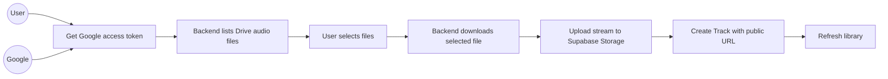
```mermaid
flowchart LR
  User((User))
  Google((Google))
  GSI[Get Google access token]
  List[Backend lists Drive audio files]
  Pick[User selects files]
  Import[Backend downloads selected file]
  Store[Upload stream to Supabase Storage]
  Track[Create Track with public URL]
  Refresh[Refresh library]

  User --> GSI
  Google --> GSI
  GSI --> List
  List --> Pick
  Pick --> Import
  Import --> Store
  Store --> Track
  Track --> Refresh
```

Drive design giup:

- Backend khong can luu Google token lau dai.
- Frontend lay Google token theo user consent.
- Backend van enforce app ownership bang JWT rieng.
- File import co URL ngay, khong can queue conversion.

### Playback/offline use cases

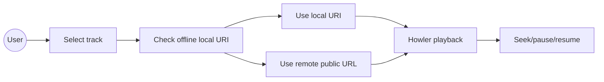
```mermaid
flowchart LR
  User((User))
  Select[Select track]
  CheckLocal[Check offline local URI]
  Remote[Use remote public URL]
  Local[Use local URI]
  Howler[Howler playback]
  Seek[Seek/pause/resume]

  User --> Select
  Select --> CheckLocal
  CheckLocal --> Local
  CheckLocal --> Remote
  Local --> Howler
  Remote --> Howler
  Howler --> Seek
```

Playback design giup:

- Backend khong can stream audio qua API.
- Client co the phat remote URL hoac local offline file.
- Player state duoc tach khoi list UI.

## 32. Database Diagram

SVG render san:

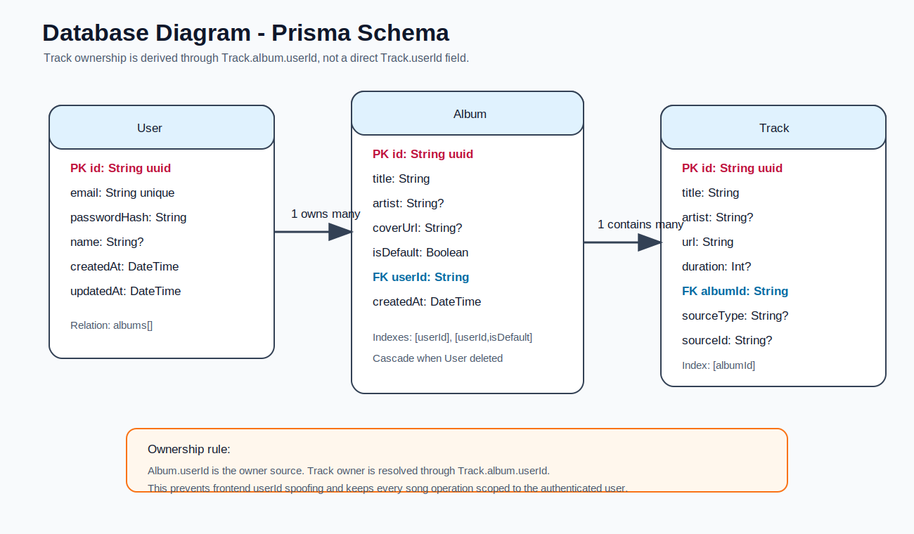

ERD theo Prisma schema hien tai:

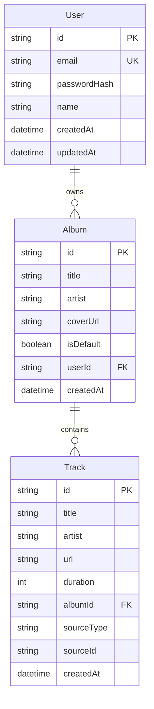
```mermaid
erDiagram
  User ||--o{ Album : owns
  Album ||--o{ Track : contains

  User {
    string id PK
    string email UK
    string passwordHash
    string name
    datetime createdAt
    datetime updatedAt
  }

  Album {
    string id PK
    string title
    string artist
    string coverUrl
    boolean isDefault
    string userId FK
    datetime createdAt
  }

  Track {
    string id PK
    string title
    string artist
    string url
    int duration
    string albumId FK
    string sourceType
    string sourceId
    datetime createdAt
  }
```

Relation nghiep vu:

- `User -> Album`: mot user co nhieu album.
- `Album -> Track`: mot album co nhieu track.
- `Track -> User`: khong co direct FK, owner duoc suy ra qua `Track.album.userId`.

Index hien co:

```text
Album:
  @@index([userId])
  @@index([userId, isDefault])

Track:
  @@index([albumId])
```

Tac dung cua index:

- `Album.userId`: toi uu list album cua mot user.
- `[userId, isDefault]`: toi uu tim default album khi convert/import khong chon album.
- `Track.albumId`: toi uu relation album -> tracks va cascade lookup theo album.

Query pattern chinh:

```text
GET /albums:
  Album.findMany where userId = currentUser.id

GET /albums/:id:
  Album.findFirst where id = param.id and userId = currentUser.id

GET /songs:
  Track.findMany where album.userId = currentUser.id include album

GET /songs/:id:
  Track.findFirst where id = param.id and album.userId = currentUser.id

PATCH /songs/:id/move:
  Track.findFirst where id = param.id and album.userId = currentUser.id
  Album.findUnique where id = targetAlbumId
  Check targetAlbum.userId == currentUser.id
```

Database design hien tai toi uu cho:

- Private library theo user.
- List album nhanh.
- Tim default album nhanh.
- Xoa user/album cascade xuong du lieu con.

Database design chua toi uu cho:

- Loc songs theo album truc tiep tu API trong frontend album detail. Hien frontend fetch all songs roi filter client-side.
- Dam bao chi co mot default album bang DB constraint. Hien chi co index, chua co unique partial index.
- Search title/artist. Hien chua co index text search.

## 33. Component Diagram Backend

SVG render san:

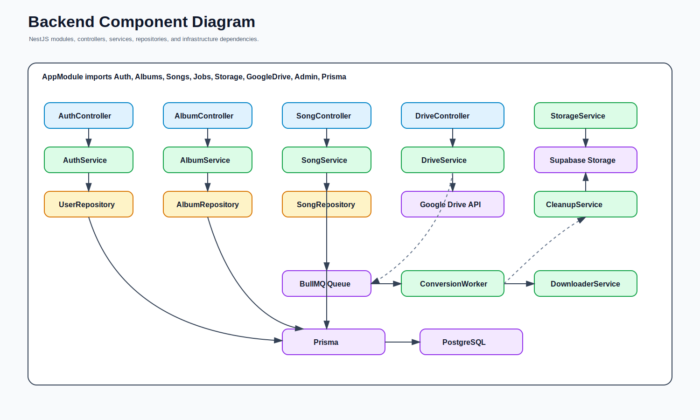

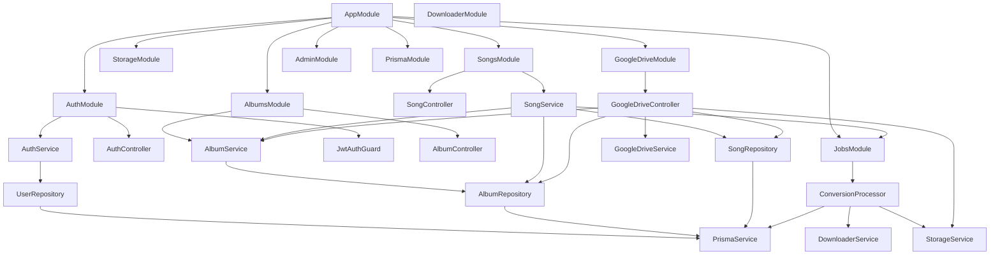
```mermaid
flowchart TB
  AppModule[AppModule]
  AuthModule[AuthModule]
  AlbumsModule[AlbumsModule]
  SongsModule[SongsModule]
  JobsModule[JobsModule]
  StorageModule[StorageModule]
  DownloaderModule[DownloaderModule]
  DriveModule[GoogleDriveModule]
  AdminModule[AdminModule]
  PrismaModule[PrismaModule]

  AuthController[AuthController]
  AuthService[AuthService]
  JwtGuard[JwtAuthGuard]
  UserRepo[UserRepository]

  AlbumController[AlbumController]
  AlbumService[AlbumService]
  AlbumRepo[AlbumRepository]

  SongController[SongController]
  SongService[SongService]
  SongRepo[SongRepository]

  DriveController[GoogleDriveController]
  DriveService[GoogleDriveService]

  Conversion[ConversionProcessor]
  Downloader[DownloaderService]
  Storage[StorageService]
  Prisma[PrismaService]

  AppModule --> AuthModule
  AppModule --> AlbumsModule
  AppModule --> SongsModule
  AppModule --> JobsModule
  AppModule --> StorageModule
  AppModule --> DriveModule
  AppModule --> AdminModule
  AppModule --> PrismaModule

  AuthModule --> AuthController
  AuthModule --> AuthService
  AuthModule --> JwtGuard
  AuthService --> UserRepo
  UserRepo --> Prisma

  AlbumsModule --> AlbumController
  AlbumsModule --> AlbumService
  AlbumService --> AlbumRepo
  AlbumRepo --> Prisma

  SongsModule --> SongController
  SongsModule --> SongService
  SongService --> SongRepo
  SongService --> AlbumRepo
  SongService --> AlbumService
  SongService --> JobsModule
  SongRepo --> Prisma

  JobsModule --> Conversion
  Conversion --> Downloader
  Conversion --> Storage
  Conversion --> Prisma

  DriveModule --> DriveController
  DriveController --> DriveService
  DriveController --> Storage
  DriveController --> SongRepo
  DriveController --> AlbumService
  DriveController --> AlbumRepo
```

Backend component design giup:

- `AuthModule` global nen guard/JWT dung duoc o cac module khac.
- `AlbumsModule` export `AlbumService` va `AlbumRepository`, nen `SongsModule` va `GoogleDriveModule` co the dung ownership/default album logic.
- `SongsModule` export `SongRepository`, nen `GoogleDriveModule` va `AdminModule` tao/xoa track duoc.
- `StorageModule` export ca concrete service va provider token `IStorageProvider`, nen cleanup service co the lam viec qua interface.
- `JobsModule` export BullMQ de `SongService` inject queue.

## 34. Component Diagram Frontend

SVG render san:

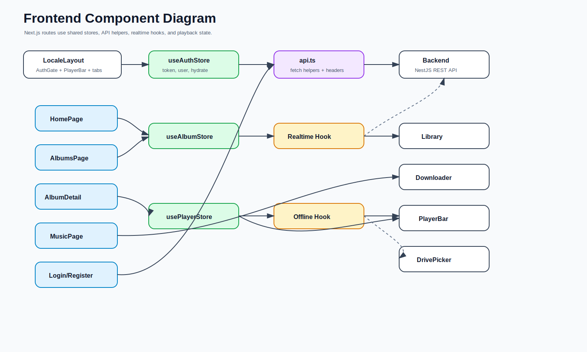

```mermaid
flowchart TB
  Layout[app/[locale]/layout.tsx]
  AuthGate[AuthGate]
  NavWrapper[NavWrapper]
  PlayerBar[PlayerBar]
  BottomTab[BottomTabBar]

  Home[HomePageClient]
  Albums[AlbumsClient]
  AlbumDetail[AlbumDetailClient]
  MusicPage[MusicPage]
  Login[LoginPage]
  Register[RegisterPage]

  API[src/lib/api.ts]
  AuthStore[useAuthStore]
  AlbumStore[useAlbumStore]
  PlayerStore[usePlayerStore]
  Realtime[useSupabaseRealtime]
  Offline[useOfflineStorage]
  DriveHook[useGoogleDrive]

  Library[Library]
  Downloader[Downloader]
  DrivePicker[DrivePicker]

  Layout --> AuthGate
  Layout --> NavWrapper
  NavWrapper --> PlayerBar
  NavWrapper --> BottomTab

  AuthGate --> AuthStore
  AuthStore --> API

  Home --> API
  Home --> AlbumStore
  Home --> AuthStore
  Home --> Realtime

  Albums --> API
  Albums --> AlbumStore
  Albums --> AuthStore

  AlbumDetail --> API
  AlbumDetail --> AlbumStore
  AlbumDetail --> AuthStore
  AlbumDetail --> Realtime
  AlbumDetail --> Library

  MusicPage --> Downloader
  Downloader --> API
  Downloader --> AuthStore
  Downloader --> AlbumStore

  Library --> API
  Library --> AuthStore
  Library --> PlayerStore
  Library --> Offline
  Library --> Realtime

  DrivePicker --> API
  DrivePicker --> AuthStore
  DriveHook --> API

  Login --> API
  Login --> AuthStore
  Register --> API
  Register --> AuthStore
  PlayerBar --> PlayerStore
```

Frontend component design giup:

- Layout boc auth va player/navigation mot lan cho toan locale route.
- API layer tap trung nen component khong can lap URL/header logic.
- Auth store la diem duy nhat quan ly token/localStorage/session reset.
- Album store giup Home, Albums page, Downloader select album dung chung data.
- Player store tach playback khoi Library, nen PlayerBar co the dieu khien bai dang phat o bat ky page nao.
- Realtime hook dung chung cho Home, Album detail, Library.

## 35. Lifecycle Diagram Cho Tung Luong

Tu "recycle diagram" trong yeu cau, phan nay hieu la lifecycle/state-cycle diagram: mot object/request di qua cac trang thai nao.

SVG render san cho cac lifecycle chinh:

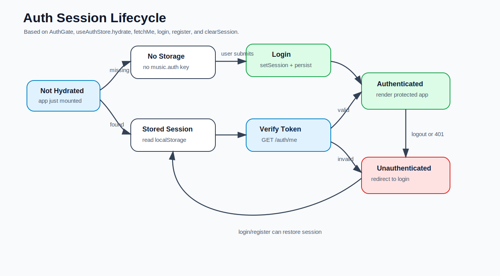

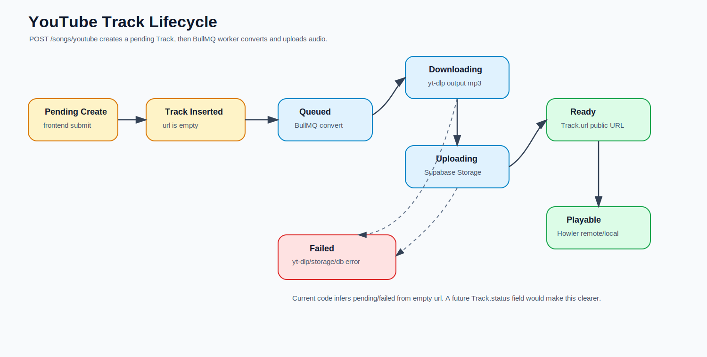

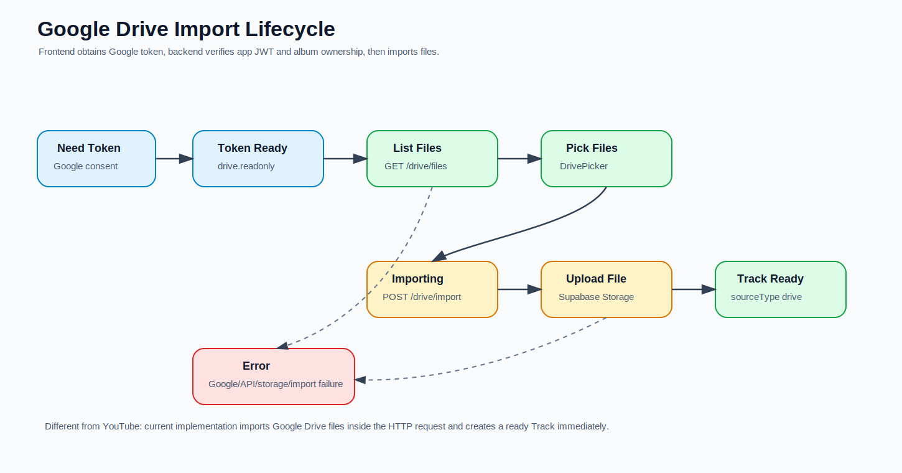

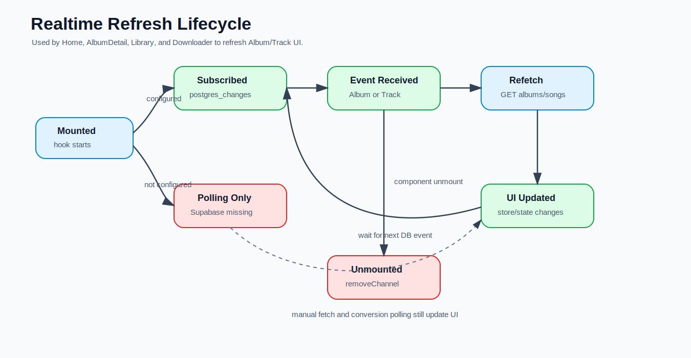

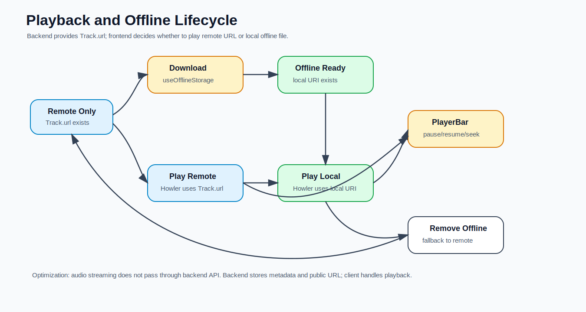

### Auth session lifecycle

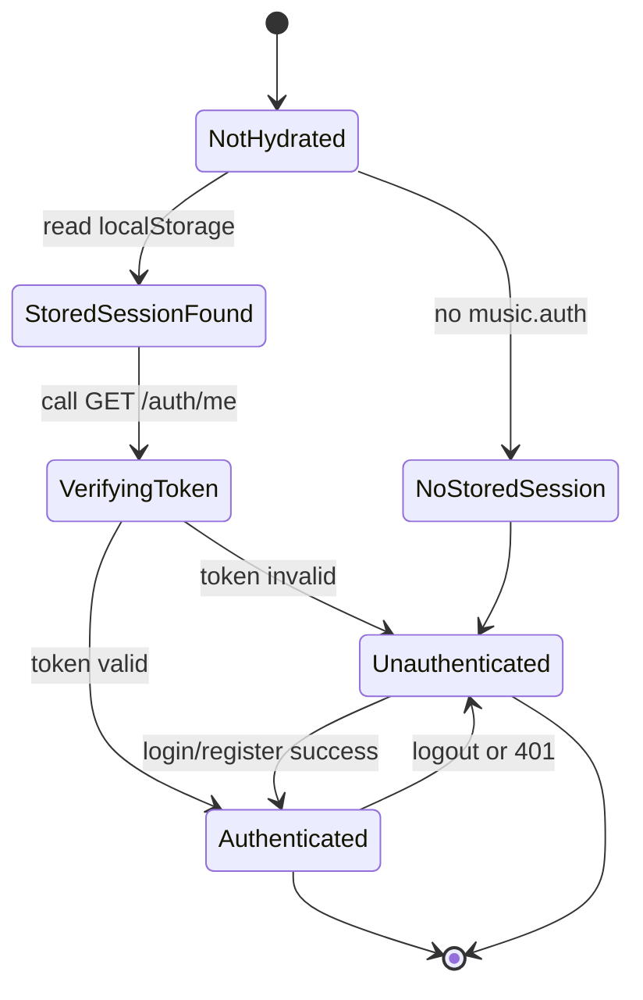
```mermaid
stateDiagram-v2
  [*] --> NotHydrated
  NotHydrated --> NoStoredSession: no music.auth
  NotHydrated --> StoredSessionFound: read localStorage
  StoredSessionFound --> VerifyingToken: call GET /auth/me
  VerifyingToken --> Authenticated: token valid
  VerifyingToken --> Unauthenticated: token invalid
  NoStoredSession --> Unauthenticated
  Authenticated --> Unauthenticated: logout or 401
  Unauthenticated --> Authenticated: login/register success
  Authenticated --> [*]
  Unauthenticated --> [*]
```

Toi uu:

- Khong tin localStorage mot cach mu quang.
- Moi refresh deu verify `/auth/me`.
- Khi user logout/invalid token, album/player state reset theo.

### Album lifecycle

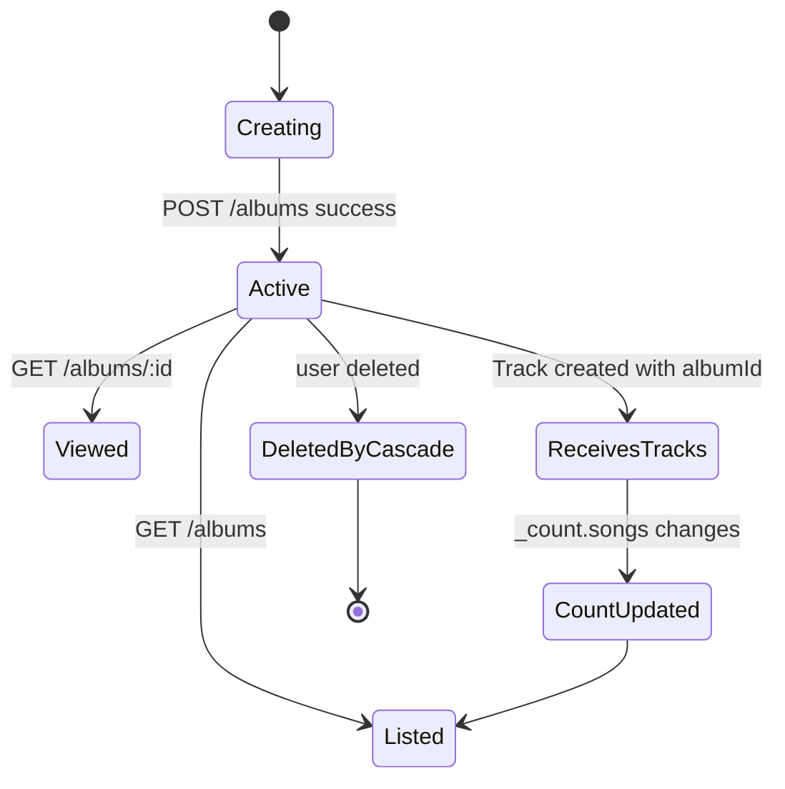
```mermaid
stateDiagram-v2
  [*] --> Creating
  Creating --> Active: POST /albums success
  Active --> Listed: GET /albums
  Active --> Viewed: GET /albums/:id
  Active --> ReceivesTracks: Track created with albumId
  ReceivesTracks --> CountUpdated: _count.songs changes
  CountUpdated --> Listed
  Active --> DeletedByCascade: user deleted
  DeletedByCascade --> [*]
```

Toi uu:

- Album luon co owner.
- Album count duoc tinh tu database relation.
- Default album duoc tao lazy de import/convert khong can buoc tao album.

### YouTube track lifecycle

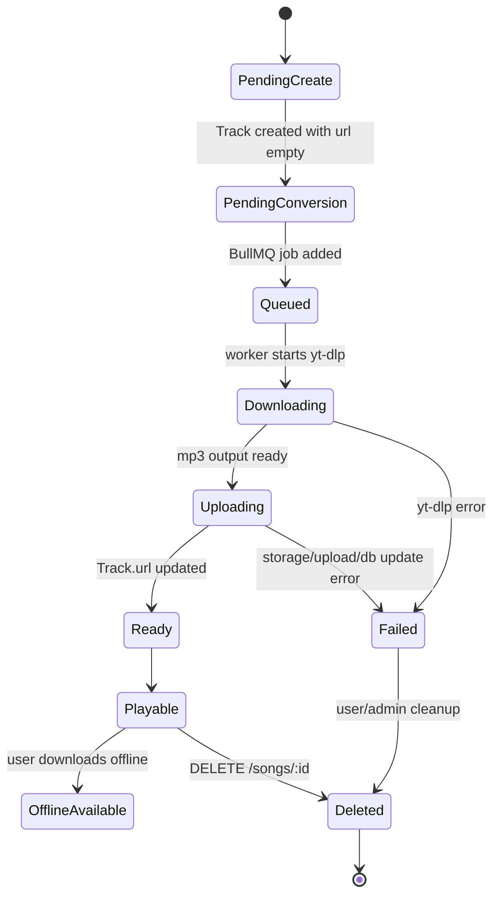
```mermaid
stateDiagram-v2
  [*] --> PendingCreate
  PendingCreate --> PendingConversion: Track created with url empty
  PendingConversion --> Queued: BullMQ job added
  Queued --> Downloading: worker starts yt-dlp
  Downloading --> Uploading: mp3 output ready
  Uploading --> Ready: Track.url updated
  Downloading --> Failed: yt-dlp error
  Uploading --> Failed: storage/upload/db update error
  Ready --> Playable
  Playable --> OfflineAvailable: user downloads offline
  Playable --> Deleted: DELETE /songs/:id
  Failed --> Deleted: user/admin cleanup
  Deleted --> [*]
```

Toi uu:

- HTTP tao song nhanh vi conversion di qua queue.
- UI co the theo doi pending -> ready bang realtime/polling.
- File temp duoc cleanup sau job.

Rui ro hien tai:

- Failed track co the con trong DB voi `url=""`.
- Chua co field `status`, nen frontend suy ra failed/pending bang `url`.

### Google Drive import lifecycle

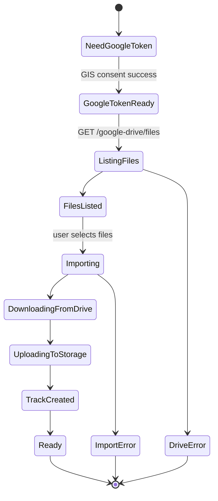
```mermaid
stateDiagram-v2
  [*] --> NeedGoogleToken
  NeedGoogleToken --> GoogleTokenReady: GIS consent success
  GoogleTokenReady --> ListingFiles: GET /google-drive/files
  ListingFiles --> FilesListed
  FilesListed --> Importing: user selects files
  Importing --> DownloadingFromDrive
  DownloadingFromDrive --> UploadingToStorage
  UploadingToStorage --> TrackCreated
  TrackCreated --> Ready
  ListingFiles --> DriveError
  Importing --> ImportError
  Ready --> [*]
  DriveError --> [*]
  ImportError --> [*]
```

Toi uu:

- Google token chi nam trong client/request, backend khong persist.
- Import file tao track ready ngay, khong can queue.
- Backend van verify app JWT va album ownership truoc khi ghi DB.

Rui ro hien tai:

- Import file lon co the lam HTTP request lau.
- Controller route list files return error object thay vi HTTP error, nen consumer phai check object shape.

### Realtime refresh lifecycle

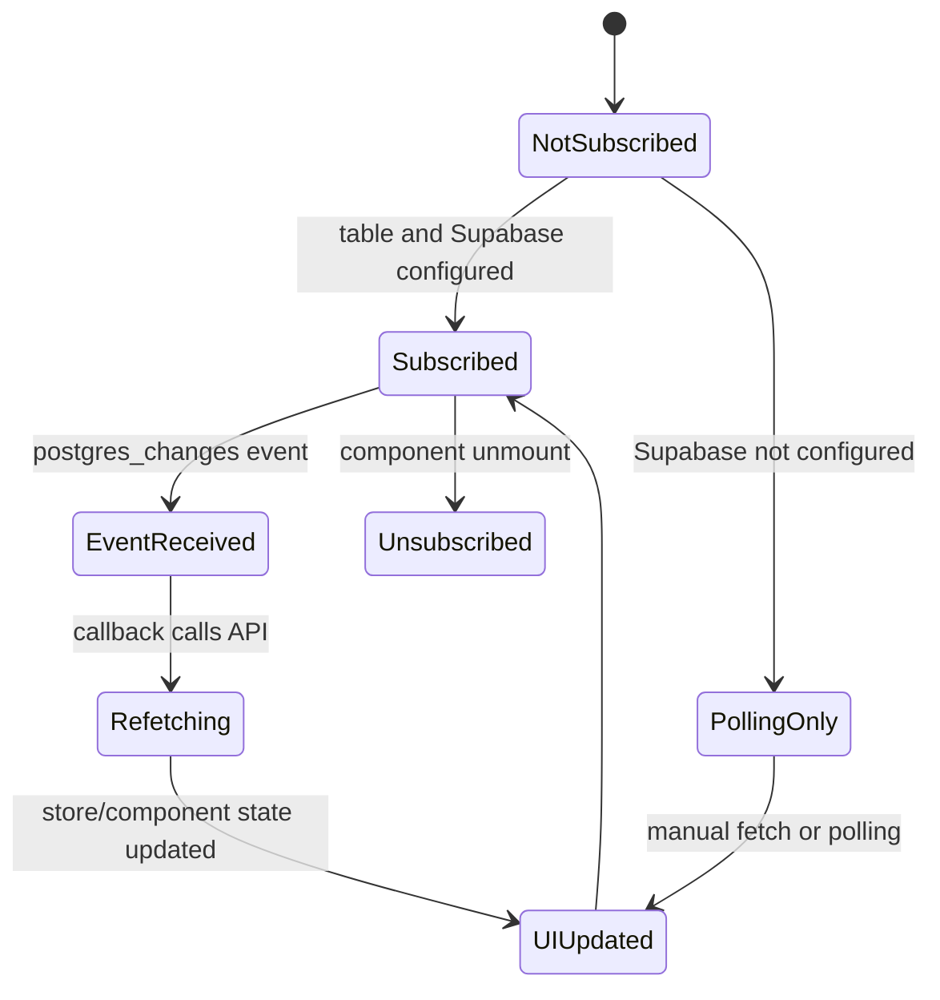
```mermaid
stateDiagram-v2
  [*] --> NotSubscribed
  NotSubscribed --> Subscribed: table and Supabase configured
  Subscribed --> EventReceived: postgres_changes event
  EventReceived --> Refetching: callback calls API
  Refetching --> UIUpdated: store/component state updated
  UIUpdated --> Subscribed
  Subscribed --> Unsubscribed: component unmount
  NotSubscribed --> PollingOnly: Supabase not configured
  PollingOnly --> UIUpdated: manual fetch or polling
```

Toi uu:

- UI cap nhat gan realtime khi backend update DB.
- Hook cleanup channel khi component unmount.
- Neu Supabase env thieu, app khong crash.

### Offline playback lifecycle

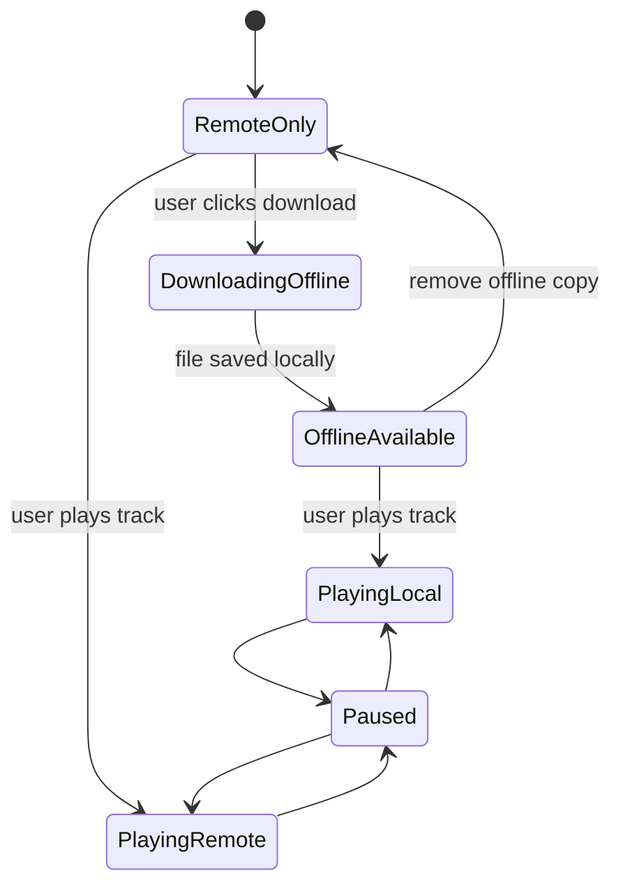
```mermaid
stateDiagram-v2
  [*] --> RemoteOnly
  RemoteOnly --> DownloadingOffline: user clicks download
  DownloadingOffline --> OfflineAvailable: file saved locally
  OfflineAvailable --> PlayingLocal: user plays track
  RemoteOnly --> PlayingRemote: user plays track
  PlayingLocal --> Paused
  PlayingRemote --> Paused
  Paused --> PlayingLocal
  Paused --> PlayingRemote
  OfflineAvailable --> RemoteOnly: remove offline copy
```

Toi uu:

- Remote URL va local URI dung chung `PlayerStore.play`.
- Offline file chi la client optimization, khong lam phuc tap backend.

## 36. Sequence Diagram Cho Cac Request Quan Trong

SVG render san:

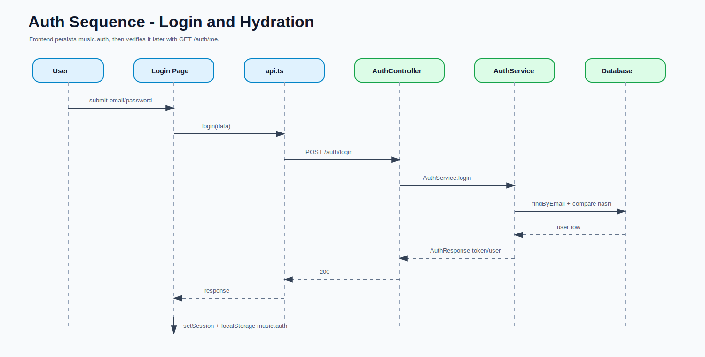

### Login sequence

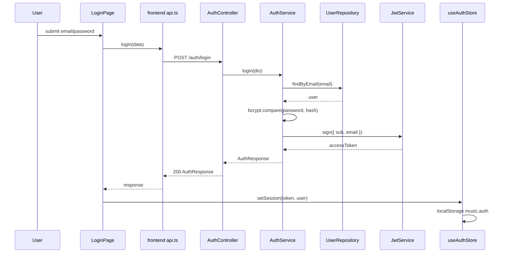
```mermaid
sequenceDiagram
  participant U as User
  participant F as LoginPage
  participant API as frontend api.ts
  participant B as AuthController
  participant S as AuthService
  participant R as UserRepository
  participant JWT as JwtService
  participant Store as useAuthStore

  U->>F: submit email/password
  F->>API: login(data)
  API->>B: POST /auth/login
  B->>S: login(dto)
  S->>R: findByEmail(email)
  R-->>S: user
  S->>S: bcrypt.compare(password, hash)
  S->>JWT: sign({ sub, email })
  JWT-->>S: accessToken
  S-->>B: AuthResponse
  B-->>API: 200 AuthResponse
  API-->>F: response
  F->>Store: setSession(token, user)
  Store->>Store: localStorage music.auth
```

### Fetch albums sequence

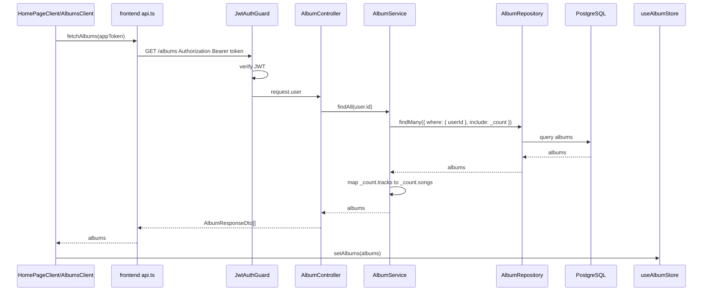
```mermaid
sequenceDiagram
  participant C as HomePageClient/AlbumsClient
  participant API as frontend api.ts
  participant G as JwtAuthGuard
  participant Ctrl as AlbumController
  participant S as AlbumService
  participant R as AlbumRepository
  participant DB as PostgreSQL
  participant Store as useAlbumStore

  C->>API: fetchAlbums(appToken)
  API->>G: GET /albums Authorization Bearer token
  G->>G: verify JWT
  G->>Ctrl: request.user
  Ctrl->>S: findAll(user.id)
  S->>R: findMany({ where: { userId }, include: _count })
  R->>DB: query albums
  DB-->>R: albums
  R-->>S: albums
  S->>S: map _count.tracks to _count.songs
  S-->>Ctrl: albums
  Ctrl-->>API: AlbumResponseDto[]
  API-->>C: albums
  C->>Store: setAlbums(albums)
```

### YouTube conversion sequence

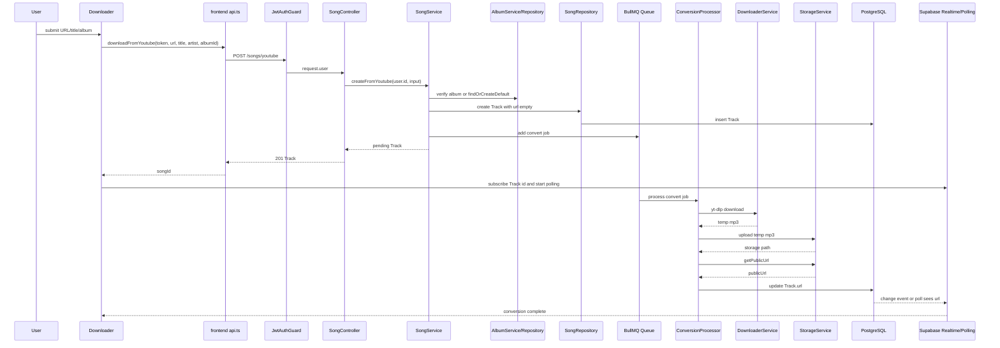
```mermaid
sequenceDiagram
  participant U as User
  participant D as Downloader
  participant API as frontend api.ts
  participant G as JwtAuthGuard
  participant Ctrl as SongController
  participant S as SongService
  participant Album as AlbumService/Repository
  participant SongRepo as SongRepository
  participant Q as BullMQ Queue
  participant W as ConversionProcessor
  participant DL as DownloaderService
  participant Storage as StorageService
  participant DB as PostgreSQL
  participant RT as Supabase Realtime/Polling

  U->>D: submit URL/title/album
  D->>API: downloadFromYoutube(token, url, title, artist, albumId)
  API->>G: POST /songs/youtube
  G->>Ctrl: request.user
  Ctrl->>S: createFromYoutube(user.id, input)
  S->>Album: verify album or findOrCreateDefault
  S->>SongRepo: create Track with url empty
  SongRepo->>DB: insert Track
  S->>Q: add convert job
  S-->>Ctrl: pending Track
  Ctrl-->>API: 201 Track
  API-->>D: songId
  D->>RT: subscribe Track id and start polling
  Q->>W: process convert job
  W->>DL: yt-dlp download
  DL-->>W: temp mp3
  W->>Storage: upload temp mp3
  Storage-->>W: storage path
  W->>Storage: getPublicUrl
  Storage-->>W: publicUrl
  W->>DB: update Track.url
  DB-->>RT: change event or poll sees url
  RT-->>D: conversion complete
```

### Google Drive import sequence

```mermaid
sequenceDiagram
  participant U as User
  participant H as useGoogleDrive
  participant GSI as Google Identity Services
  participant API as frontend api.ts
  participant Ctrl as GoogleDriveController
  participant Guard as JwtAuthGuard
  participant Drive as GoogleDriveService
  participant Storage as StorageService
  participant Album as AlbumRepository/Service
  participant SongRepo as SongRepository
  participant DB as PostgreSQL

  U->>H: click Google login
  H->>GSI: request drive.readonly token
  GSI-->>H: googleAccessToken
  H->>API: fetchGoogleDriveFiles(appToken, googleToken)
  API->>Guard: GET /google-drive/files?token=...
  Guard->>Ctrl: request.user
  Ctrl->>Drive: listFiles(googleToken)
  Drive-->>Ctrl: audio file candidates
  Ctrl-->>API: files
  U->>API: importFromDrive(fileId, googleToken, albumId)
  API->>Guard: POST /google-drive/import
  Guard->>Ctrl: request.user
  Ctrl->>Album: verify album or create default
  Ctrl->>Drive: getFileMetadata
  Ctrl->>Drive: downloadFile stream
  Ctrl->>Storage: uploadStream(bucket music, path)
  Storage-->>Ctrl: storage path
  Ctrl->>Storage: getPublicUrl
  Ctrl->>SongRepo: create Track sourceType google-drive
  SongRepo->>DB: insert Track
  Ctrl-->>API: Track
```

## 37. Data Flow Diagram Theo Boundary

SVG render san:

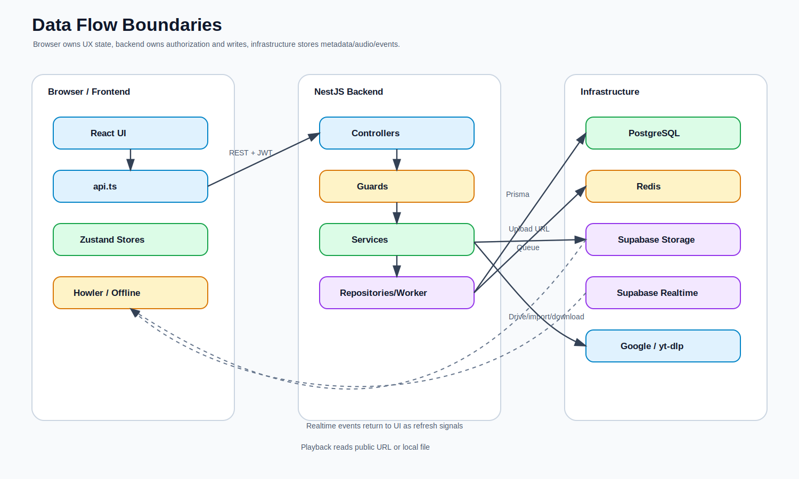

```mermaid
flowchart TB
  subgraph Browser["Browser / Client"]
    UI[React Components]
    APIClient[API helpers]
    Stores[Zustand Stores]
    Howler[Howler Player]
    LocalStorage[(localStorage music.auth)]
    OfflineFS[(Offline file storage)]
  end

  subgraph Backend["NestJS Backend"]
    Controllers[Controllers]
    Guards[JwtAuthGuard]
    Services[Services]
    Repos[Repositories]
    Worker[Conversion Worker]
  end

  subgraph DataInfra["Data / Infra"]
    PG[(PostgreSQL)]
    Redis[(Redis)]
    SupabaseStorage[(Supabase Storage)]
    SupabaseRealtime[Supabase Realtime]
    GoogleDrive[Google Drive API]
    YTDLP[yt-dlp]
  end

  UI --> Stores
  Stores --> LocalStorage
  UI --> APIClient
  APIClient --> Controllers
  Controllers --> Guards
  Guards --> Services
  Services --> Repos
  Repos --> PG
  Services --> Redis
  Redis --> Worker
  Worker --> YTDLP
  Worker --> SupabaseStorage
  Worker --> PG
  Services --> GoogleDrive
  Services --> SupabaseStorage
  PG --> SupabaseRealtime
  SupabaseRealtime --> UI
  UI --> Howler
  Howler --> SupabaseStorage
  UI --> OfflineFS
  Howler --> OfflineFS
```

Boundary quan trong:

- Browser chi giu app JWT va Google token tam thoi.
- Backend verify app JWT truoc moi protected DB write/read.
- PostgreSQL la source of truth cho metadata.
- Supabase Storage la source of truth cho audio binary/public URL.
- Supabase Realtime la notification layer, khong phai source of truth.
- Redis/BullMQ la processing layer cho conversion, khong phai noi luu data chinh.

## 38. Optimization Opportunities Theo Design Hien Tai

### API/error handling

Hien tai:

- API helper throw message chung.
- Component check unauthorized bang string matching.

Nen toi uu:

```ts
class ApiError extends Error {
  status: number;
  body?: unknown;
}
```

Loi ich:

- Component co the check `error.status === 401`.
- De handle `404`, `409`, validation error nhat quan.
- Giam bug session khong clear khi backend tra 401.

### Song status model

Hien tai:

- Track pending/failed/ready duoc suy ra bang `url`.

Nen toi uu:

```text
Track.status: pending | processing | ready | failed
Track.errorMessage?: string
```

Loi ich:

- UI hien conversion status ro hon.
- Failed job khong bi hien nhu processing failed chi vi `url=""`.
- Co the retry failed conversion.

### Album detail query

Hien tai:

- `Library` fetch tat ca songs roi filter client-side theo albumId.

Nen toi uu:

```text
GET /songs?albumId=<id>
```

Backend verify album owner truoc khi query.

Loi ich:

- Giam payload khi user co nhieu songs.
- Album detail load nhanh hon.
- Frontend logic don gian hon.

### Default album uniqueness

Hien tai:

- Co index `[userId, isDefault]`, chua unique partial constraint.

Nen toi uu DB:

```sql
CREATE UNIQUE INDEX unique_default_album_per_user
ON "Album" ("userId")
WHERE "isDefault" = true;
```

Loi ich:

- DB ep moi user chi co mot default album.
- Race condition duoc giai quyet o persistence layer.

### Admin route protection

Hien tai:

- `AdminController` khong thay `UseGuards(JwtAuthGuard)`.

Nen toi uu:

- Them admin auth guard hoac remove route khoi public runtime.
- Neu can admin role, them role/claim vao user/JWT.

Loi ich:

- Tranh xoa track/storage tuy tien.
- Ro boundary giua user route va admin route.

### Google Drive import async

Hien tai:

- Import Drive download/upload trong HTTP request.

Nen toi uu neu file lon:

```text
POST /google-drive/import
  -> create pending Track
  -> enqueue drive-import job
  -> worker download/upload
  -> update Track.url/status
```

Loi ich:

- Giam timeout request.
- Giong YouTube conversion, UX status nhat quan.
- De retry khi import failed.

### Realtime filtering

Hien tai:

- `useSupabaseRealtime('Track', loadTracks)` subscribe table-level changes.

Nen toi uu:

- Dung filter theo user/album neu Supabase policy/schema cho phep.
- Hoac callback check payload albumId/user relation truoc khi refetch.

Loi ich:

- Giam refetch khong can thiet.
- Tot hon khi nhieu user cung dung realtime.

## 39. Design Summary Theo Use Case

| Use case | Design dang dung | No toi uu diem nao | Can canh giac |
| --- | --- | --- | --- |
| Login/register | JWT + Zustand + localStorage + `/auth/me` | Session nhanh, refresh duoc, backend stateless | Revoke token kho neu khong co blacklist |
| View albums | User-scoped query + album store | Bao mat user data, UI reload nhanh | Store stale neu khong refetch dung luc |
| Create album | Backend gan owner tu JWT | Khong spoof duoc userId | DTO reject field ngoai expected |
| Add YouTube song | Pending track + BullMQ worker | Khong block request, scale worker rieng | Can status field de quan ly failed tot hon |
| View songs | Query qua album owner | Khong cross-user leak | Album detail dang fetch all songs |
| Move/delete song | Verify source/target ownership | Chan cross-user mutation | Delete chua cleanup storage |
| Google Drive import | Google token per request + backend ownership check | Khong persist Google token, import truc tiep | Request co the lau voi file lon |
| Realtime refresh | Supabase postgres_changes | UI cap nhat gan realtime | Can filter tot hon khi scale |
| Offline playback | Client local file + Howler | Giam network, nghe lai nhanh | Can UX quan ly storage |
| Admin cleanup | Direct repository/storage action | Huu ich debug/ops | Can auth/role guard |
